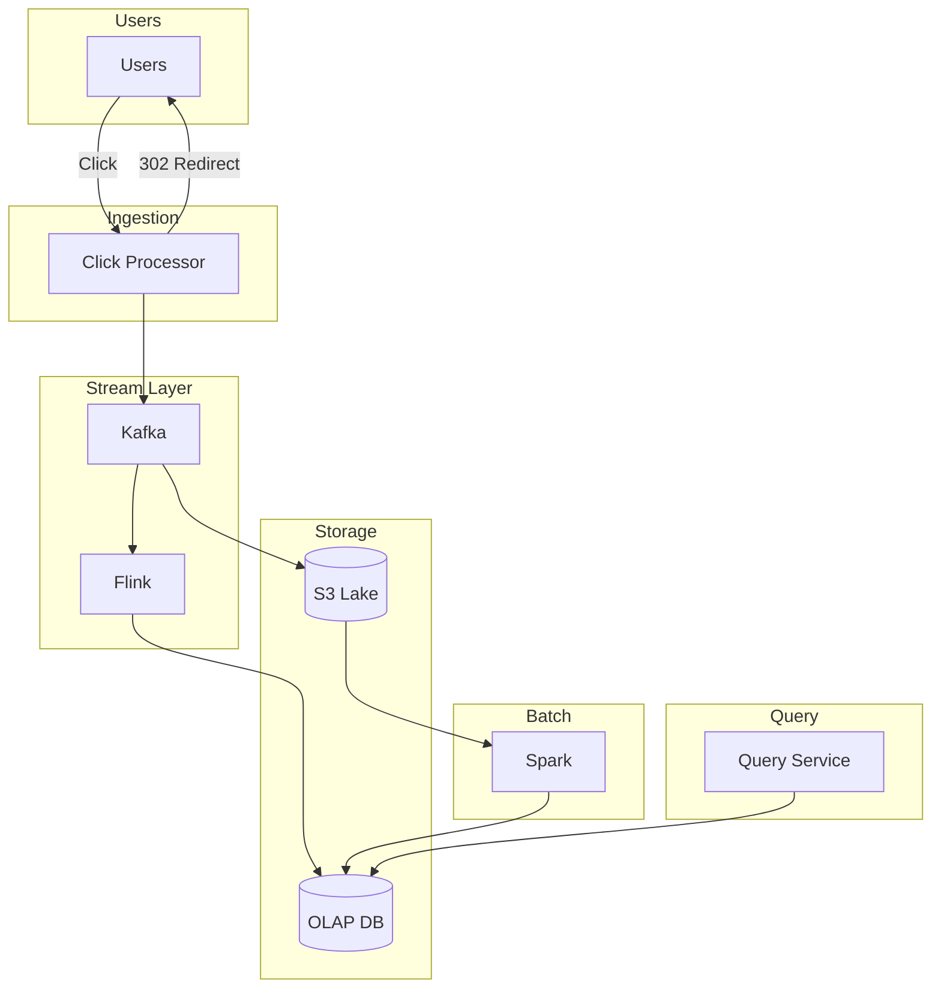

# Ad Click Aggregator - Quick Cheatsheet

> ⏱️ **5-minute revision before interview**

---

## 📋 Requirements Summary

### Functional Requirements
| # | Requirement |
|---|-------------|
| 1 | Users click ads → redirected to advertiser site |
| 2 | Advertisers query click metrics (1-min granularity) |

### Non-Functional Requirements
| # | Requirement | Target |
|---|-------------|--------|
| 1 | Throughput | 10k clicks/second |
| 2 | Query Latency | Sub-second |
| 3 | Data Accuracy | Zero data loss |
| 4 | Freshness | Near real-time |
| 5 | Idempotency | No duplicate counts |

---

## 🏗️ High-Level Architecture



---

## 🔍 Deep Dives

### 1. Redirect Handling

| Approach | Description | Verdict |
|----------|-------------|---------|
| ❌ **Client Redirect** | JS pixel fires to advertiser | Bad - Ad blockers, unreliable |
| ✅ **Server Redirect** | Click → Server → 302 | Good - Full control, accurate |

```
✅ GOOD: User clicks → /click endpoint → Track → 302 Redirect
❌ BAD:  User clicks → Direct to advertiser + Fire pixel (blocked!)
```

### 2. Click Processing

| Approach | Description | Verdict |
|----------|-------------|---------|
| ❌ **Sync DB Write** | Write directly to OLAP | Bad - Slow, not scalable |
| ⚠️ **Batch Processing** | Accumulate → Periodic job | OK - Minutes latency |
| ✅ **Stream Processing** | Kafka → Flink → OLAP | Good - Seconds latency |

```
✅ GOOD: Click → Kafka → Flink (1-min windows) → OLAP → Query in seconds
❌ BAD:  Click → Direct OLAP insert → Slow queries, high write load
```

### 3. Fault Tolerance & Data Accuracy

| Approach | Description | Verdict |
|----------|-------------|---------|
| ❌ **Stream Only** | Trust Flink completely | Bad - Processing errors happen |
| ✅ **Stream + Reconciliation** | Real-time + Daily batch compare | Good - Catches all errors |

```
✅ GOOD:
   Real-time: Kafka → Flink → OLAP (fast)
   Batch:     S3 → Spark → Compare with OLAP → Fix discrepancies

❌ BAD: Only stream processing, never verify accuracy
```

**Checkpointing Decision:**
```
1-minute windows → Don't need checkpointing (just replay from Kafka)
1-hour+ windows → Need checkpointing (too much to recompute)

💡 Interview Insight: Show critical thinking, not just textbook answers!
```

### 4. Hot Shards (Viral Ads)

| Approach | Description | Verdict |
|----------|-------------|---------|
| ❌ **Ignore** | Let shard overload | Bad - Data loss, latency |
| ✅ **Salted Keys** | ad_id:random(0-N) | Good - Spreads load |

```
✅ GOOD: nike_123 → nike_123:0, nike_123:1, ... nike_123:9 → 10 partitions
❌ BAD:  nike_123 → All 8000 clicks/s to 1 partition → Overload!
```

### 5. Idempotency (Duplicate Prevention)

| Approach | Description | Verdict |
|----------|-------------|---------|
| ❌ **DB Constraint** | Reject at write time | Bad - Already processed |
| ✅ **Flink Dedup** | State with TTL | Good - Real-time dedup |

```
✅ GOOD:
   click_id = hash(ad_id + user_id + timestamp_minute)
   Flink keeps 5-min state → Drops duplicates

❌ BAD: Count all clicks, check for duplicates later
```

### 6. Low Latency Queries

| Approach | Description | Verdict |
|----------|-------------|---------|
| ❌ **Query Raw Minutes** | Aggregate at query time | Bad - Slow for large ranges |
| ✅ **Pre-aggregation** | Roll up to hour/day/week | Good - O(1) for any range |

```
✅ GOOD:
   1-min → hourly rollup → daily rollup → monthly rollup
   Query monthly? Read 12 rows, not 525,600!

❌ BAD: Query a year of 1-minute data = 525,600 rows to aggregate
```

---

## 📊 Key Numbers

| Metric | Value |
|--------|-------|
| Peak clicks/second | 10,000 |
| Daily clicks | 100 million |
| Active ads | 10 million |
| Kafka shard limit | 1 MB/s or 1000 rec/s |
| Event size | ~200 bytes |
| Daily raw storage | ~20 GB |
| Kafka shards needed | 10-15 |

---

## 💬 Interview Phrases

1. *"Kafka + Flink for real-time aggregation with sub-second latency"*
2. *"Partition by ad_id ensures all events for an ad go to same processor"*
3. *"Daily reconciliation from S3 catches any real-time processing errors"*
4. *"Salt partition keys for hot ads to spread load"*
5. *"Pre-aggregated rollups enable sub-second queries for any time range"*

---

## ⚠️ Pitfalls to Avoid

1. ❌ Writing directly to OLAP without stream
2. ❌ Ignoring hot shard problem
3. ❌ No reconciliation process
4. ❌ Client-side redirect only
5. ❌ Over-engineering checkpointing for small windows

---

## 🏗️ Technology Stack

| Component | Technology |
|-----------|------------|
| Stream | Kafka / Kinesis |
| Processor | Apache Flink |
| OLAP | ClickHouse / Druid |
| Data Lake | S3 |
| Batch | Spark |
