# Ad Click Aggregator System Design

> **Difficulty**: Hard | **Company**: Google, Meta, Amazon, Twitter

> ⚡ **[Quick Cheatsheet](./CHEATSHEET.md)** - 5-minute revision with Good vs Bad patterns

## Table of Contents
- [Overview](#overview)
- [Requirements](#requirements)
- [System Interface](#system-interface)
- [Data Flow](#data-flow)
- [High-Level Design](#high-level-design)
- [Deep Dives](#deep-dives)
- [Capacity Estimation](#capacity-estimation)
- [Interview Level Expectations](#interview-level-expectations)

---

## Overview

An Ad Click Aggregator collects and aggregates data on ad clicks, enabling advertisers to track performance and optimize campaigns. This is a data processing-focused system design.


### Key Characteristics

| Aspect | Description |
|--------|-------------|
| **Type** | Data Processing / Analytics Pipeline |
| **Focus** | Real-time aggregation + Batch reconciliation |
| **Challenge** | High throughput writes + Low latency reads |

---

## Requirements

### Functional Requirements ✅

| Requirement | Priority | Description |
|-------------|----------|-------------|
| Click & Redirect | Core | Users click ads and get redirected to advertiser site |
| Query Metrics | Core | Advertisers query click metrics at 1-minute granularity |
| Ad Targeting | Out of Scope | Deciding which ads to show |
| Ad Serving | Out of Scope | Rendering ads on pages |
| Cross-device Tracking | Out of Scope | Tracking users across devices |
| Offline Integration | Out of Scope | Connecting with offline marketing |

### Non-Functional Requirements ✅

| Requirement | Target | Priority |
|-------------|--------|----------|
| Peak Throughput | 10,000 clicks/second | Core |
| Query Latency | Sub-second response | Core |
| Data Accuracy | No click data loss | Core |
| Freshness | Near real-time (seconds) | Core |
| Idempotency | No duplicate counting | Core |
| Daily Volume | ~100M clicks/day | Core |
| Active Ads | 10M | Core |
| Fraud Detection | Out of Scope | - |
| Geo Profiling | Out of Scope | - |

---

## System Interface

### Input/Output

```
┌─────────────────────────────────────────────────────────────┐
│                    SYSTEM BOUNDARY                          │
├─────────────────────────────────────────────────────────────┤
│                                                             │
│   INPUT                              OUTPUT                 │
│   ─────                              ──────                 │
│   Ad click events                    Aggregated metrics     │
│   from users                         for advertisers        │
│                                                             │
│   • ad_id                            • clicks_per_minute    │
│   • user_id                          • clicks_per_hour      │
│   • timestamp                        • clicks_per_day       │
│   • device_info                      • unique_users         │
│                                                             │
└─────────────────────────────────────────────────────────────┘
```

### API Endpoints

#### 1. Track Click & Redirect

```http
GET /click?ad_id={ad_id}&user_id={user_id}

Response: 302 Redirect
Location: https://advertiser-website.com/landing
```

#### 2. Query Metrics

```http
GET /metrics?ad_id={ad_id}&start={timestamp}&end={timestamp}&granularity=minute

Response:
{
  "ad_id": "ad_123",
  "metrics": [
    {
      "timestamp": "2024-01-15T10:00:00Z",
      "clicks": 1542,
      "unique_users": 1398
    },
    {
      "timestamp": "2024-01-15T10:01:00Z",
      "clicks": 1623,
      "unique_users": 1456
    }
  ]
}
```

---

## Data Flow


### Detailed Flow

| Step | Action | Component |
|------|--------|-----------|
| 1 | User clicks ad on website | Browser |
| 2 | Click event sent to /click endpoint | Click Processor |
| 3 | User redirected to advertiser URL | Click Processor |
| 4 | Click aggregated in real-time | Stream Processor |
| 5 | Advertiser queries aggregated data | Query Service |

---

## High-Level Design

### Redirect Handling Options

| Approach | How It Works | Pros | Cons |
|----------|--------------|------|------|
| **Server Redirect** ✅ | Click → Server → 302 Redirect | Full control, accurate tracking | Extra hop latency |
| **Client Redirect** | Click → Advertiser + Pixel | Lower latency | Less reliable, ad blockers |

---

### Click Processing Options

| Approach | Description | Latency | Complexity |
|----------|-------------|---------|------------|
| **Sync Write to DB** | Write directly to OLAP | Minutes+ | Low |
| **Batch Processing** | Accumulate → Periodic aggregate | Minutes-Hours | Medium |
| **Stream Processing** ✅ | Real-time aggregation | Seconds | High |

---

### Complete Architecture


---

### Click Processing Flow


---

### Query Flow


---

### Stream Processing Detail


---

## Deep Dives

### 1. Scaling to 10k Clicks/Second 📈

#### Bottleneck Analysis

| Component | Bottleneck | Solution |
|-----------|------------|----------|
| Click Processor | CPU/Memory | Horizontal scaling + LB |
| Kafka | Throughput per partition | Shard by ad_id |
| Flink | Processing capacity | Parallel tasks per shard |
| OLAP DB | Write throughput | Shard by advertiser_id |

#### Kafka Partitioning Strategy


**Why partition by ad_id?**
- All events for same ad go to same partition
- Enables parallel processing across ads
- Flink tasks can aggregate independently

#### Kinesis Limits

| Limit | Value | Solution |
|-------|-------|----------|
| Write throughput | 1 MB/s per shard | Add more shards |
| Records | 1000/s per shard | Add more shards |
| For 10k clicks/s | | ~15-20 shards minimum |

---

### Hot Shard Problem 🔥

When a viral ad (e.g., Nike + LeBron) gets massive clicks, one partition gets overwhelmed.

```
Normal: 10k clicks → 20 shards → 500 clicks/shard ✅
Hot Ad: 8k clicks to one ad → 1 shard → 8k clicks/shard 💀
```

#### Solution: Salted Partition Key

```
Original key: ad_id = "nike_lebron"
                    ↓
Salted key: ad_id:random(0-9) = "nike_lebron:7"
                    ↓
Spreads across 10 partitions instead of 1
```


**Note:** Apply salting only to hot ads (based on ad spend or historical volume).

---

### 2. Ensuring Zero Data Loss 🛡️

#### Defense Layers


#### Kafka/Kinesis Durability

| Feature | Description |
|---------|-------------|
| Replication | Data copied to 3+ brokers |
| Persistence | Data stored on disk |
| Retention | Configurable (7 days recommended) |
| Recovery | Replay from any offset |

#### Flink Checkpointing


**When is checkpointing needed?**

| Aggregation Window | Checkpointing Value |
|-------------------|---------------------|
| 1 minute | Low (just replay 1 min) |
| 1 hour | Medium |
| 1 day/week | High (critical!) |

> 💡 **Interview Insight**: For 1-minute windows, checkpointing overhead may not be worth it. Just replay from Kafka. This shows critical thinking!

---

#### Reconciliation Process

```mermaid
flowchart TB
    subgraph RealTime[Real-time Path]
        Kafka1[Kafka] --> Flink1[Flink]
        Flink1 --> OLAP1[OLAP DB<br/>Real-time data]
    end

    subgraph Batch[Batch Path]
        Kafka2[Kafka] --> S3[S3 Raw Events]
        S3 --> Spark[Spark Job<br/>Hourly/Daily]
        Spark --> Compare{Compare}
    end

    OLAP1 --> Compare

    Compare -->|Match| OK[✅ Data correct]
    Compare -->|Mismatch| Fix[🔧 Update OLAP]
```



**Why reconciliation?**
- Catch transient Flink errors
- Handle out-of-order events
- Recover from bad code deploys
- Guarantee data accuracy for billing

---

### 3. Preventing Duplicate Clicks (Idempotency) 🔄

#### The Problem

```
User double-clicks ad → 2 click events → Advertiser charged twice! 💀
```

#### Solutions Comparison

| Approach | How It Works | Pros | Cons |
|----------|--------------|------|------|
| **Unique Constraint** | DB rejects duplicates | Simple | Doesn't prevent processing |
| **Dedup in Flink** ✅ | Track seen clicks in memory/state | Real-time, efficient | Memory overhead |
| **Bloom Filter** | Probabilistic dedup | Low memory | False positives possible |

#### Flink Deduplication


**Dedup Key Generation:**

```
click_id = hash(ad_id + user_id + timestamp_minute)

Example:
ad_id: "nike_123"
user_id: "user_456"
timestamp: "2024-01-15T10:05:32Z" → truncate → "2024-01-15T10:05"

click_id = hash("nike_123:user_456:2024-01-15T10:05")
         = "a1b2c3d4"
```

**State Management:**

| Parameter | Value | Reason |
|-----------|-------|--------|
| Dedup Window | 5 minutes | Covers legitimate retries |
| State Backend | RocksDB | Handles large state |
| TTL | 5 minutes | Auto-cleanup old entries |

---

### 4. Low Latency Queries ⚡

#### Pre-Aggregation Strategy

Real-time aggregation gives us 1-minute granularity. For larger windows (day/week/month), we pre-aggregate.


#### Query Routing


#### Caching Strategy

| Data Type | Cache TTL | Reason |
|-----------|-----------|--------|
| Real-time (last hour) | 30 seconds | Frequently changing |
| Today's data | 5 minutes | Still accumulating |
| Historical data | 1 hour+ | Static |

---

## Capacity Estimation

### Traffic Volume

| Metric | Value |
|--------|-------|
| Peak clicks/second | 10,000 |
| Daily clicks | ~100 million |
| Active ads | 10 million |
| Clicks per ad per day | ~10 (average) |

### Storage Estimation

#### Raw Click Events

| Component | Calculation | Result |
|-----------|-------------|--------|
| Event size | ~200 bytes | - |
| Daily events | 100M × 200B | **20 GB/day** |
| Monthly | 20 GB × 30 | **600 GB/month** |
| Yearly (S3) | 600 GB × 12 | **7.2 TB/year** |

#### Aggregated Data (OLAP)

| Component | Calculation | Result |
|-----------|-------------|--------|
| Aggregated row | ~100 bytes | - |
| Rows per ad per day | 1440 (1 per minute) | - |
| Active ads | 10M | - |
| Daily OLAP writes | 10M × 1440 × 100B | **1.44 TB/day** |

> 💡 With rollups and retention policies, actual OLAP storage is much lower.

### Kafka Sizing

| Metric | Calculation | Result |
|--------|-------------|--------|
| Events/second | 10,000 | - |
| Event size | 200 bytes | - |
| Throughput | 10k × 200B | **2 MB/s** |
| Per shard limit | 1 MB/s | - |
| Shards needed | 2 MB/s ÷ 1 MB/s | **3 minimum** |
| With headroom | | **10-15 shards** |

### Flink Sizing

| Metric | Value |
|--------|-------|
| Events/second | 10,000 |
| Parallelism | = Number of Kafka partitions |
| Tasks | 10-15 (1 per partition) |
| Memory per task | 2-4 GB |
| Total cluster memory | ~50 GB |

---

## Interview Level Expectations

### Mid-Level 👨‍💻

| Should Demonstrate | Acceptable Gaps |
|--------------------|-----------------|
| Understand need for pre-aggregation | Real-time vs batch trade-offs |
| Propose batch processing solution | Flink implementation details |
| Problem-solve on idempotency when asked | Hot shard handling |
| Reasonable database choice | Reconciliation process |

### Senior 👩‍💼

| Should Demonstrate | Nice to Have |
|--------------------|--------------|
| Speed through basic design quickly | Kafka internals |
| Discuss real-time vs batch trade-offs | Flink checkpointing details |
| Propose fault-tolerant solution | Advanced OLAP optimizations |
| Justify technology choices | Multi-region deployment |
| Recognize need for stream processing | |

### Staff+ 🏆

| Should Demonstrate | Deep Expertise In |
|--------------------|-------------------|
| Clear trade-off analysis (batch vs stream) | Production experience with similar systems |
| Fault-tolerant, complete solution | Reconciliation patterns |
| Deep database choice justification | Hot shard mitigation strategies |
| Drive entire discussion independently | Teach interviewer something new |

---

## Final Architecture Summary

```
User Click → Load Balancer → Click Processor → Kafka (partitioned)
                   ↓                              ↓
              302 Redirect                   ┌────┴────┐
                   ↓                         ↓         ↓
           Advertiser Site              Flink      S3 Lake
                                         ↓           ↓
                                    OLAP DB ← ← Spark Reconciliation
                                         ↓
                              Query Service + Cache
                                         ↓
                              Advertiser Dashboard
```

---

## References

- [Apache Flink Documentation](https://flink.apache.org/)
- [Apache Kafka Documentation](https://kafka.apache.org/)
- [ClickHouse for Analytics](https://clickhouse.com/)
- [Lambda Architecture](https://en.wikipedia.org/wiki/Lambda_architecture)
