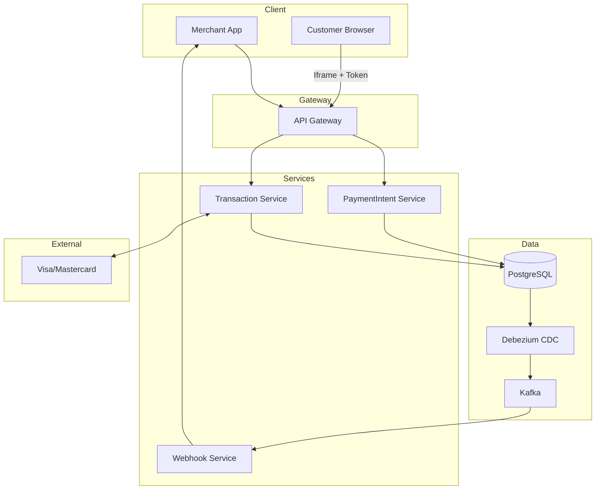

# Payment System - Quick Cheatsheet

> ⏱️ **5-minute revision before interview**

---

## 📋 Requirements Summary

### Functional Requirements
| # | Requirement |
|---|-------------|
| 1 | Merchants initiate payment requests (PaymentIntent) |
| 2 | Users pay with credit/debit cards |
| 3 | Merchants view payment status updates |

### Non-Functional Requirements
| # | Requirement | Target |
|---|-------------|--------|
| 1 | Security | PCI-DSS compliant |
| 2 | Durability | Zero data loss |
| 3 | Transaction Safety | No double-charging |
| 4 | Scalability | 10,000+ TPS |

---

## 🏗️ High-Level Architecture



---

## 🔍 Deep Dives

### 1. Security 🔐

| Approach | Description | Verdict |
|----------|-------------|---------|
| ❌ **Direct API** | Merchant collects card → sends to us | Bad - Merchant in full PCI scope |
| ❌ **Redirect** | Customer redirected to our page | Bad - Poor UX |
| ✅ **Iframe + Tokenization** | Our JS in merchant page, tokenize on client | Good - Zero raw data exposure |

```
✅ GOOD: Customer → Stripe Iframe → Token → Merchant → Payment API
❌ BAD:  Customer → Merchant Server → Card Data → Payment API
```

### 2. Durability & Auditability 📝

| Approach | Description | Verdict |
|----------|-------------|---------|
| ❌ **DB Only** | Just write to PostgreSQL | Bad - No immutable audit trail |
| ❌ **Event Sourcing Only** | Only event log | Bad - Slow for queries |
| ✅ **Hybrid (DB + CDC + Kafka)** | DB for sync, CDC to Kafka for audit | Good - Best of both |

```
✅ GOOD: Transaction Service → PostgreSQL → CDC → Kafka (immutable log)
❌ BAD:  Transaction Service → PostgreSQL only (manual audit queries)
```

### 3. Transaction Safety ⚡

| Approach | Description | Verdict |
|----------|-------------|---------|
| ❌ **Timeout = Failure** | Assume failed on timeout | Bad - May miss successful charges |
| ⚠️ **Unique Constraint** | DB-level duplicate prevention | OK - Basic protection |
| ✅ **Idempotency + Pending Resolution** | Pending state + reconciliation | Good - Handles async networks |

```
✅ GOOD: Create pending → Call network → Update on response → Reconcile unknowns
❌ BAD:  Call network → Timeout → Mark failed (but bank may have charged!)
```

**Two-Phase Event Model:**
```
Phase 1: Transaction Created Event (before DB write)
Phase 2: Transaction Completed Event (after DB write)
→ Enables safe retry by comparing phases
```

### 4. Scalability 📈

| Component | Strategy |
|-----------|----------|
| Services | Horizontal scaling + Load balancer |
| Kafka | 3-5 partitions, partition by `payment_intent_id` |
| Database | Shard by `merchant_id`, read replicas |
| Cold Storage | Archive data > 3-6 months to S3 |

---

## 📊 Key Numbers

| Metric | Value |
|--------|-------|
| TPS | 10,000 |
| Storage/year | ~150-180 TB |
| Kafka partitions | 3-5 |
| Replication factor | 3 |

---

## 💬 Interview Phrases

1. *"PaymentIntent abstracts complexity from merchants"*
2. *"CDC gives guaranteed consistency without code changes"*
3. *"Idempotency keys ensure exactly-once processing"*
4. *"We embrace eventual consistency because payment networks are async"*
5. *"Iframe isolation keeps card data out of merchant's PCI scope"*

---

## ⚠️ Pitfalls to Avoid

1. ❌ Assuming timeout = failure
2. ❌ Storing raw card data
3. ❌ Single partition Kafka
4. ❌ No idempotency keys
5. ❌ Polling-only for merchants
