# Payment System Design (Stripe-like)

> **Difficulty**: Hard | **Company**: Stripe, PayPal, Square, Adyen

## Table of Contents
- [Overview](#overview)
- [Requirements](#requirements)
- [Core Entities](#core-entities)
- [API Design](#api-design)
- [High-Level Design](#high-level-design)
- [Deep Dives](#deep-dives)
- [Capacity Estimation](#capacity-estimation)
- [Interview Level Expectations](#interview-level-expectations)
- [Quick Revision Cheatsheet](#quick-revision-cheatsheet)

---

## Overview

Payment processors like Stripe allow merchants to accept payments without building their own infrastructure. Customers input payment details on merchant websites, and the payment system handles processing, returning results to merchants.

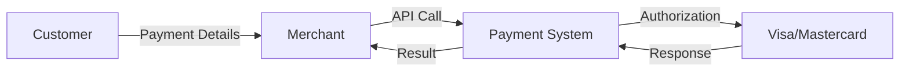

---

## Requirements

### Functional Requirements ✅

| Requirement | Priority |
|-------------|----------|
| Merchants initiate payment requests | Core |
| Users pay with credit/debit cards | Core |
| Merchants view payment status updates | Core |
| Save payment methods | Out of Scope |
| Issue refunds | Out of Scope |
| Transaction history/reports | Out of Scope |
| Alternative payment methods | Out of Scope |
| Recurring payments/subscriptions | Out of Scope |
| Payouts to merchants | Out of Scope |

### Non-Functional Requirements ✅

| Requirement | Target | Priority |
|-------------|--------|----------|
| High Security | PCI-DSS compliant | Core |
| Durability & Auditability | Zero data loss | Core |
| Transaction Safety | No double-charging | Core |
| Scalability | 10,000+ TPS | Core |
| Regulatory Compliance | Region-specific | Out of Scope |
| Extensibility | Plugin architecture | Out of Scope |

---

## Core Entities

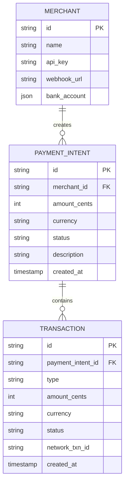

### Entity Details

| Entity | Purpose | Key Fields |
|--------|---------|------------|
| **Merchant** | Business using our platform | id, api_key, webhook_url, bank_account |
| **PaymentIntent** | Merchant's intention to collect payment | id, merchant_id, amount, currency, status |
| **Transaction** | Actual money movement record | id, payment_intent_id, type, status |

### PaymentIntent vs Transaction

```
PaymentIntent (1) ────────> (Many) Transaction

Example scenarios:
├── Retry after failure      → Same PaymentIntent, new Transaction
├── Partial payments         → Same PaymentIntent, multiple Transactions
└── Refunds                  → Same PaymentIntent, negative Transaction
```

### PaymentIntent Status Flow

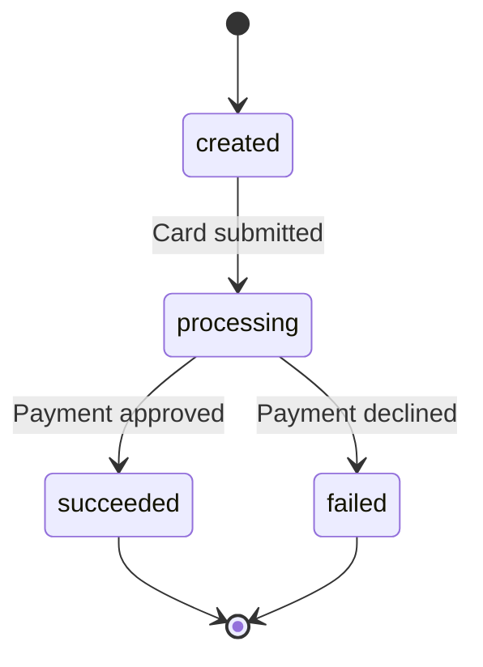

---

## API Design

### 1. Create PaymentIntent

```http
POST /payment-intents
Authorization: Bearer {api_key}
Content-Type: application/json

{
  "amountInCents": 2499,
  "currency": "usd",
  "description": "Order #1234"
}
```

**Response:**
```json
{
  "id": "pi_1AbCdEfGhIjKlM",
  "amountInCents": 2499,
  "currency": "usd",
  "status": "created",
  "created": 1633031200
}
```

### 2. Process Payment (Create Transaction)

```http
POST /payment-intents/{paymentIntentId}/transactions
Content-Type: application/json

{
  "type": "charge",
  "card": {
    "number": "4242424242424242",
    "exp_month": 12,
    "exp_year": 2025,
    "cvc": "123"
  }
}
```

> ⚠️ **Security Note**: In production, raw card data NEVER touches merchant servers. Tokenization via iframes is used instead.

### 3. Get PaymentIntent Status

```http
GET /payment-intents/{paymentIntentId}
Authorization: Bearer {api_key}
```

**Response:**
```json
{
  "id": "pi_1AbCdEfGhIjKlM",
  "amountInCents": 2499,
  "currency": "usd",
  "status": "succeeded",
  "transactions": [
    {
      "id": "txn_1XyZ",
      "type": "charge",
      "status": "succeeded"
    }
  ]
}
```

### 4. Webhook Callback (Push Notification)

```http
POST {merchant_webhook_url}
Content-Type: application/json
X-Signature: {hmac_signature}

{
  "id": "evt_1JklMnOpQrStUv",
  "type": "payment.succeeded",
  "created": 1633031234,
  "data": {
    "object": {
      "id": "pi_1AbCdEfGhIjKlM",
      "amountInCents": 2499,
      "currency": "usd",
      "status": "succeeded"
    }
  }
}
```

---

## High-Level Design

### Complete Architecture

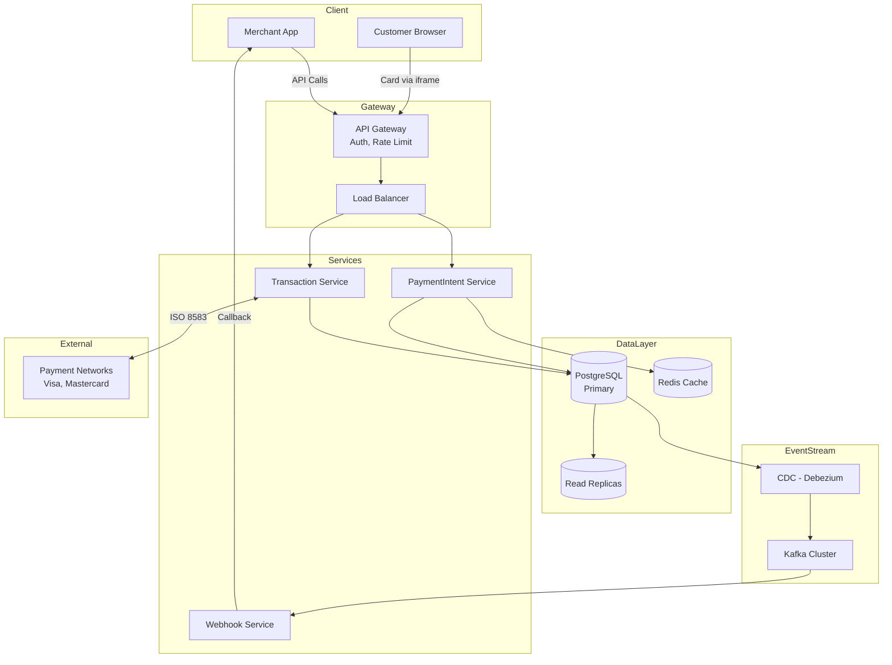

### Flow 1: Create PaymentIntent

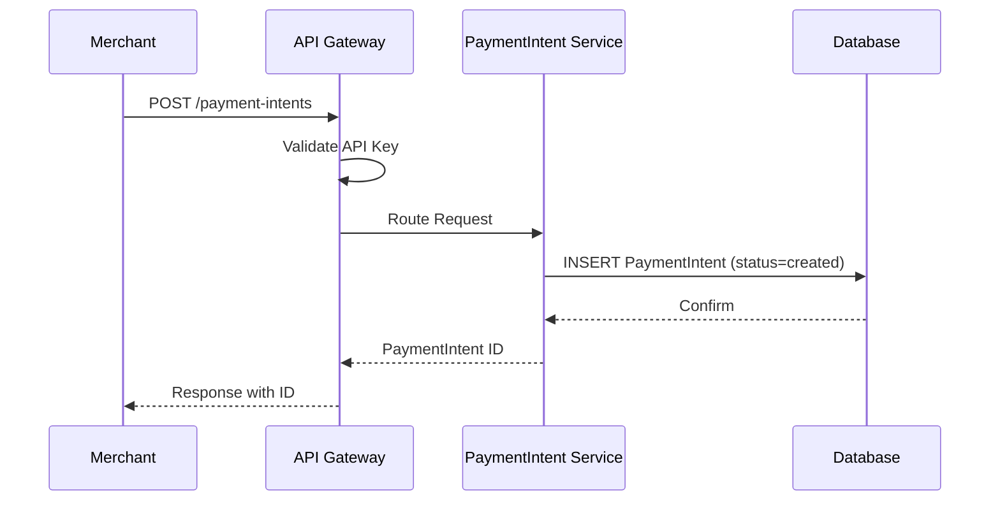

### Flow 2: Process Payment

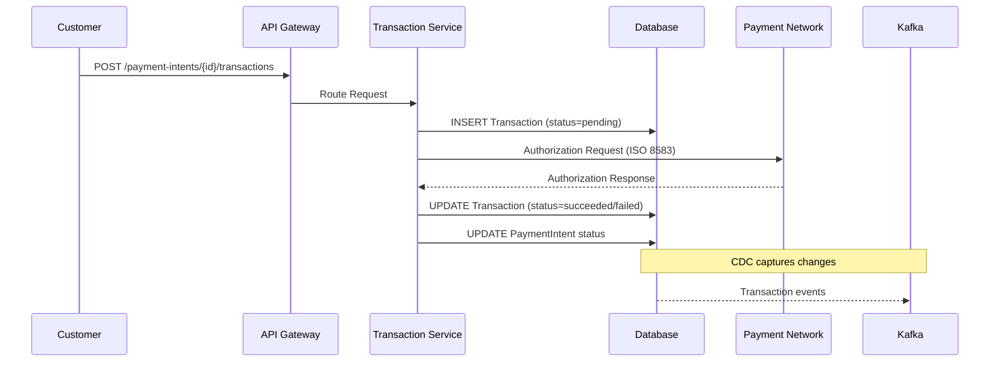

### Flow 3: Webhook Delivery

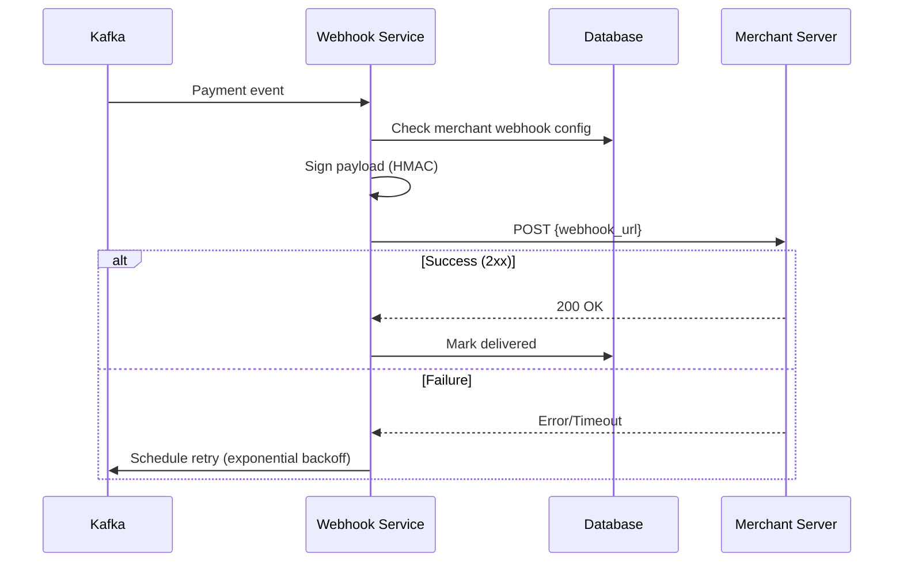

---

## Deep Dives

### 1. Security 🔐

#### Authentication Approaches

| Approach | Pros | Cons | Use Case |
|----------|------|------|----------|
| **API Keys Only** | Simple | Keys can leak | Basic integrations |
| **API Keys + IP Whitelist** | Extra layer | Hard to manage | Server-to-server |
| **API Keys + HMAC Signatures** | Request integrity | Complex implementation | Production |
| **OAuth 2.0 + mTLS** | Enterprise-grade | Overhead | Large merchants |

#### Card Data Protection

| Approach | How It Works | PCI Scope |
|----------|--------------|-----------|
| **Direct API** | Merchant collects → sends to us | Merchant in full scope ❌ |
| **Redirect** | Customer redirected to our page | Minimal scope, poor UX |
| **Iframe/Elements** | Our JS in merchant page | Minimal scope ✅ |
| **Tokenization** | Card → Token on client | Zero raw data exposure ✅ |

**Recommended: Iframe + Tokenization**

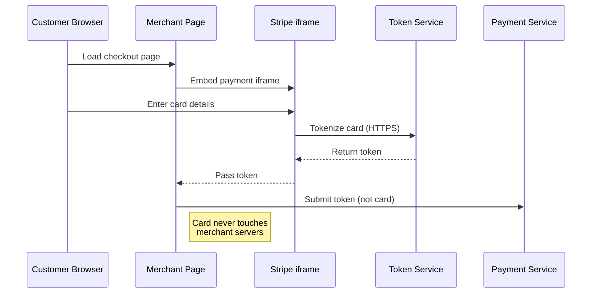

---

### 2. Durability & Auditability 📝

#### The Problem
- Every transaction = real money
- Regulations require complete audit trails
- Must prove exactly what happened for disputes

#### Approaches

| Approach | Durability | Auditability | Performance |
|----------|------------|--------------|-------------|
| **DB Only** | Good with replicas | Manual queries | High |
| **Event Sourcing Only** | Excellent | Built-in | Lower for queries |
| **Hybrid (DB + CDC + Kafka)** | Excellent | Excellent | Balanced ✅ |

#### Recommended: Hybrid Architecture

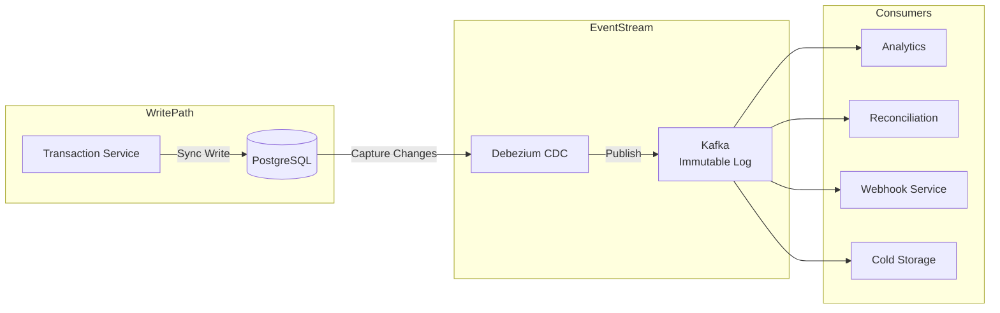

**Why CDC (Change Data Capture)?**
- No code changes to capture events
- Guaranteed consistency with DB
- Single source of truth
- Supports replay for recovery

**CDC Failure Handling:**
- Multiple CDC instances for redundancy
- Alert on lag > threshold
- Replay from DB logs if needed
- Application-level fallback writes

---

### 3. Transaction Safety ⚡

#### The Problem: Asynchronous Payment Networks

```
Timeline showing the problem:
─────────────────────────────────────────────────────────────────
Customer clicks pay
        │
        ▼
Request sent to bank ─────────────────► Bank processes
        │                                     │
        ▼                                     │
Timeout after 30s                             │
        │                                     ▼
        ▼                                Bank approves
Merchant retries ─────────────────────► Second charge!
        │
        ▼
DOUBLE CHARGE 💀
```

#### Approaches

| Approach | Safety | Complexity | Recommended |
|----------|--------|------------|-------------|
| **Timeout = Failure** | Risky | Low | ❌ |
| **Unique Constraint** | DB-level protection | Low | ✅ Basic |
| **Idempotency Keys** | Client-controlled | Medium | ✅ Good |
| **Pending + Reconciliation** | Best safety | High | ✅ Production |

#### Recommended: Idempotency + Pending Resolution

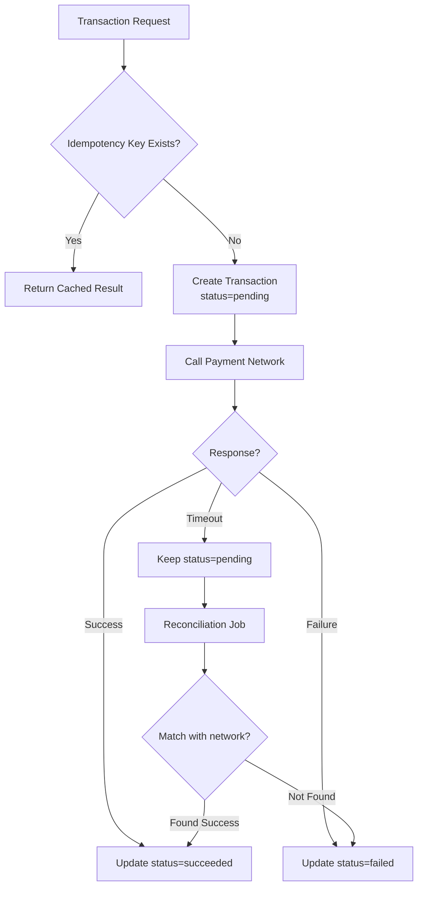

**Two-Phase Event Model (Production Pattern):**

```
Phase 1: Transaction Created Event
├── Emitted BEFORE DB write
├── If fails → transaction enters locked state
└── Can be retried

Phase 2: Transaction Completed Event
├── Emitted AFTER DB write succeeds
├── If fails → transaction locked for updates
└── Compare Phase 1 data vs DB for retries
```

---

### 4. Scalability 📈

#### Target Scale
- **10,000 TPS** at peak
- **Bursty traffic** (holiday sales)

#### Component Scaling

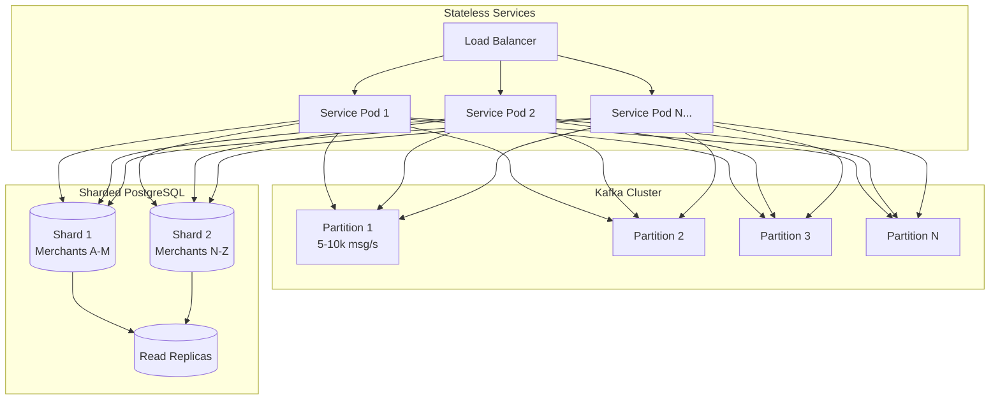

#### Kafka Partitioning Strategy

| Aspect | Strategy | Reason |
|--------|----------|--------|
| **Partition Key** | `payment_intent_id` | Ordering per PaymentIntent |
| **Partitions** | 3-5 minimum | Each handles 5-10k msg/s |
| **Replication** | Factor of 3 | Fault tolerance |
| **Consumer Groups** | Per service | Parallel processing |

#### Database Scaling

| Strategy | Purpose |
|----------|---------|
| **Shard by merchant_id** | Distribute write load |
| **Read replicas** | Handle status queries |
| **Redis cache** | Recent payment statuses |
| **Cold storage archival** | Data > 3-6 months |

---

## Capacity Estimation

### Transaction Volume

| Metric | Value |
|--------|-------|
| Peak TPS | 10,000 |
| Daily transactions | 10,000 × 86,400 = **864 million** |
| Monthly transactions | ~26 billion |

### Storage Estimation

| Component | Calculation | Result |
|-----------|-------------|--------|
| Row size | ~500 bytes | - |
| Per second | 10,000 × 500B | 5 MB/s |
| Per day | 5 MB × 86,400 | **432 GB/day** |
| Per month | 432 GB × 30 | **~13 TB/month** |
| Per year | 13 TB × 12 | **~156 TB/year** |

### Kafka Throughput

| Metric | Calculation | Result |
|--------|-------------|--------|
| Messages/sec | 10,000 TPS | 10k msg/s |
| Partition capacity | 5-10k msg/s each | - |
| Partitions needed | 10k / 5k | **2-3 minimum** |
| With headroom | | **5 partitions recommended** |

### Database Performance

| Metric | Target |
|--------|--------|
| Write TPS | ~10,000 |
| Read TPS | ~50,000 (5x reads) |
| Connection pool | 100-200 per shard |
| Shards needed | 2-4 (based on merchant distribution) |

---

## Interview Level Expectations

### Mid-Level 👨‍💻

| Should Demonstrate | Acceptable Gaps |
|--------------------|-----------------|
| Core payment flow design | Deep security nuances |
| Basic security awareness | Complex tokenization |
| Simple status handling | Event sourcing details |
| Clear communication | Perfect reconciliation solution |

### Senior 👩‍💼

| Should Demonstrate | Nice to Have |
|--------------------|--------------|
| Drive conversation to security/consistency | Kafka partition strategies |
| Propose iframe isolation | CDC implementation details |
| Identify double-charging risks | Payment network protocols |
| Explain idempotency solutions | Two-phase event model |
| Horizontal scaling basics | Advanced sharding |

### Staff+ 🏆

| Should Demonstrate | Deep Expertise In |
|--------------------|-------------------|
| Product + architectural thinking | Defense-in-depth security |
| Evaluate trade-offs thoroughly | Event sourcing + reconciliation |
| Handle complex edge cases | Network outage handling |
| System-wide consistency model | Exactly-once semantics |
| Multi-region considerations | Compliance requirements |

---

## Quick Revision Cheatsheet

### 🔑 Key Concepts (One-liners)

| Concept | Remember This |
|---------|---------------|
| **PaymentIntent** | Merchant's intention, owns the state machine |
| **Transaction** | Actual money movement, many per intent |
| **Idempotency** | Same request = same result, use unique keys |
| **CDC** | Database → Kafka, zero code changes |
| **Tokenization** | Card → token on client, never raw data |
| **Reconciliation** | Match our records with payment network |

### 📊 Numbers to Remember

| Metric | Value |
|--------|-------|
| Target TPS | 10,000 |
| Kafka partition capacity | 5-10k msg/s |
| Storage per year | ~150-180 TB |
| Replication factor | 3 |
| Cold storage threshold | 3-6 months |

### 🎯 Key Trade-offs

| Decision | Option A | Option B | Winner |
|----------|----------|----------|--------|
| Event capture | Application events | CDC | CDC (consistency) |
| Card handling | Direct API | Iframe + token | Iframe (PCI scope) |
| Timeout handling | Assume failure | Pending + reconcile | Pending (safety) |
| Audit storage | Same DB | Event stream | Event stream (immutable) |

### 🚨 Common Pitfalls to Avoid

1. ❌ Assuming timeout = failure (causes missed charges)
2. ❌ Storing raw card data (PCI violation)
3. ❌ Single partition Kafka (ordering bottleneck)
4. ❌ No idempotency keys (double charges)
5. ❌ Polling-only for merchants (latency issues)

### 💬 Key Phrases for Interview

- *"PaymentIntent abstracts the complexity from merchants"*
- *"CDC gives us guaranteed consistency without code changes"*
- *"Idempotency keys ensure exactly-once payment processing"*
- *"We embrace eventual consistency because payment networks are inherently async"*
- *"Iframe isolation keeps card data out of PCI scope for merchants"*

---

## References

- [Stripe Architecture](https://stripe.com/blog/engineering)
- [PCI-DSS Compliance](https://www.pcisecuritystandards.org/)
- [ISO 8583 Message Format](https://en.wikipedia.org/wiki/ISO_8583)
- [Kafka Partitioning Best Practices](https://kafka.apache.org/documentation/)
