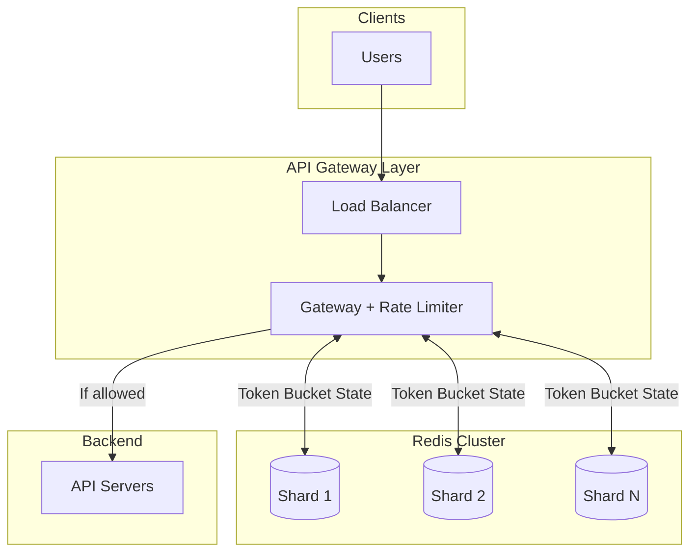

# Rate Limiter - Quick Cheatsheet

> ⏱️ **5-minute revision before interview**

---

## 📋 Requirements Summary

### Functional Requirements
| # | Requirement |
|---|-------------|
| 1 | Identify clients by user ID, IP address, or API key |
| 2 | Limit requests based on configurable rules |
| 3 | Reject with HTTP 429 + helpful headers |

### Non-Functional Requirements
| # | Requirement | Target |
|---|-------------|--------|
| 1 | Low Latency | < 10ms overhead |
| 2 | High Availability | 99.99% uptime |
| 3 | Scalability | 1M requests/second |
| 4 | Consistency | Eventual (acceptable) |

---

## 🏗️ High-Level Architecture



---

## 🔍 Deep Dives

### 1. Rate Limiting Algorithms

| Algorithm | Description | Verdict |
|-----------|-------------|---------|
| ❌ **Fixed Window** | Count per time bucket | Bad - 2x burst at boundary |
| ⚠️ **Sliding Window Log** | Track all timestamps | OK - Perfect accuracy, O(n) memory |
| ⚠️ **Sliding Window Counter** | Weighted previous + current | OK - Approximation |
| ✅ **Token Bucket** | Bucket with refill rate | Good - Handles bursts, O(1) memory |

```
✅ GOOD: Token Bucket - natural burst handling, simple, O(1)
❌ BAD:  Fixed Window - user sends 100 at 12:00:59, 100 at 12:01:00 = 200 in 2s!
```

### 2. Rate Limiter Placement

| Placement | Description | Verdict |
|-----------|-------------|---------|
| ❌ **In-Process** | Inside each service | Bad - Can't share state across instances |
| ✅ **API Gateway** | Centralized at gateway | Good - Shared state, natural fit |
| ⚠️ **Sidecar** | Service mesh pattern | OK - Added complexity |

```
✅ GOOD: All gateways → Single Redis Cluster → Consistent limits
❌ BAD:  Each service has own counter → Different views of same user
```

### 3. Redis Atomicity (Race Condition Fix)

| Approach | Description | Verdict |
|----------|-------------|---------|
| ❌ **Separate Read/Write** | HMGET then HSET | Bad - Race condition! |
| ✅ **Lua Script** | Atomic read-modify-write | Good - No race |

```
❌ BAD:
   Gateway A reads: 1 token    |    Gateway B reads: 1 token
   Both allow request          |    Both allow request
   Result: 2 requests with 1 token!

✅ GOOD: Lua script does everything atomically in Redis
```

### 4. Failure Mode

| Mode | Description | Verdict |
|------|-------------|---------|
| ⚠️ **Fail-Open** | Allow all when Redis down | OK for non-critical |
| ✅ **Fail-Closed** | Reject all when Redis down | Good for critical systems |

```
✅ GOOD (Critical): Redis down → Reject all → Protect backend from cascade
❌ BAD (Critical):  Redis down → Allow all → DDoS overwhelms backend
```

### 5. Scaling

| Component | Strategy |
|-----------|----------|
| Redis | Shard by client_id using consistent hashing |
| Gateways | Horizontal scaling |
| Connections | Connection pooling (-50ms latency) |
| Geographic | Deploy Redis per region |

```
✅ GOOD: 10 Redis shards × 100k ops/s = 1M ops/s capacity
❌ BAD:  Single Redis → 100k ops/s max → Bottleneck
```

### 6. Hot Keys

| Scenario | Solution |
|----------|----------|
| Legitimate high-volume | Client-side rate limiting, premium tiers |
| Abusive traffic | Auto-block after N hits, blocklist |

---

## 📊 Key Numbers

| Metric | Value |
|--------|-------|
| Target RPS | 1,000,000 |
| Redis per instance | 100-200k ops/s |
| Shards needed | 10-15 |
| Latency target | < 10ms |
| Memory per bucket | ~50 bytes |

---

## 💬 Interview Phrases

1. *"Token Bucket handles bursty traffic naturally"*
2. *"Lua scripts make read-modify-write atomic in Redis"*
3. *"We shard by client ID using consistent hashing"*
4. *"Fail-closed protects backend during outages"*
5. *"Connection pooling eliminates TCP handshake overhead"*

---

## ⚠️ Pitfalls to Avoid

1. ❌ Separate read/write in Redis (race condition!)
2. ❌ Fixed window for strict limits
3. ❌ Single Redis instance at scale
4. ❌ Fail-open during DDoS
5. ❌ New TCP connection per request
