# Rate Limiter System Design

> **Difficulty**: Medium-Hard | **Company**: Google, Amazon, Stripe, Cloudflare

> ⚡ **[Quick Cheatsheet](./CHEATSHEET.md)** - 5-minute revision with Good vs Bad patterns

## Table of Contents
- [Overview](#overview)
- [Requirements](#requirements)
- [Core Entities](#core-entities)
- [System Interface](#system-interface)
- [Rate Limiting Algorithms](#rate-limiting-algorithms)
- [High-Level Design](#high-level-design)
- [Deep Dives](#deep-dives)
- [Capacity Estimation](#capacity-estimation)
- [Interview Level Expectations](#interview-level-expectations)
- [Quick Revision Cheatsheet](#quick-revision-cheatsheet)

---

## Overview

A rate limiter controls how many requests a client can make within a specific timeframe. It acts like a traffic controller for your API - allowing, for example, 100 requests per minute from a user, then rejecting excess requests with HTTP 429 "Too Many Requests".


### Why Rate Limiting?

| Purpose | Description |
|---------|-------------|
| **Prevent Abuse** | Stop malicious users from overwhelming the system |
| **Protect Resources** | Prevent server overload during traffic spikes |
| **Ensure Fairness** | Equal access for all users |
| **Cost Control** | Limit expensive operations |
| **SLA Compliance** | Enforce API usage agreements |

---

## Requirements

### Functional Requirements ✅

| Requirement | Priority | Description |
|-------------|----------|-------------|
| Client Identification | Core | Identify by user ID, IP address, or API key |
| Request Limiting | Core | Limit based on configurable rules (e.g., 100 req/min) |
| Proper Rejection | Core | Return HTTP 429 with helpful headers |
| Complex Analytics | Out of Scope | Querying/analytics on rate limit data |
| Long-term Persistence | Out of Scope | Historical rate limit data storage |

### Non-Functional Requirements ✅

| Requirement | Target | Priority |
|-------------|--------|----------|
| Low Latency | < 10ms overhead per request | Core |
| High Availability | 99.99% uptime | Core |
| Consistency | Eventual consistency acceptable | Core |
| Scalability | 1M requests/second | Core |
| Users | 100M daily active users | Core |
| Strong Consistency | Strict limits across all nodes | Out of Scope |

---

## Core Entities


### Entity Details

| Entity | Purpose | Key Fields |
|--------|---------|------------|
| **Rule** | Rate limiting policy | requests_per_window, window_size, endpoint |
| **Client** | Entity being limited | id, type (user/IP/API key) |
| **Client State** | Current usage tracking | tokens, last_refill |
| **Request** | Incoming API request | client_id, endpoint, timestamp |

### Client Identification Methods

```
┌─────────────────────────────────────────────────────────────┐
│                    Client Identification                     │
├─────────────────┬─────────────────┬─────────────────────────┤
│   User ID       │   IP Address    │      API Key            │
│   (JWT Token)   │ (X-Forwarded-For│    (X-API-Key)          │
├─────────────────┼─────────────────┼─────────────────────────┤
│ Best for auth   │ Good for public │ Best for developer      │
│ APIs            │ APIs            │ APIs                    │
├─────────────────┼─────────────────┼─────────────────────────┤
│ Per-user limits │ Beware NAT/VPN  │ Per-key limits          │
└─────────────────┴─────────────────┴─────────────────────────┘
```

---

## System Interface

### Rate Limit Check

```typescript
isRequestAllowed(clientId: string, ruleId: string): {
  passes: boolean,
  remaining: number,
  resetTime: timestamp
}
```

### HTTP Response Headers

```http
HTTP/1.1 429 Too Many Requests
X-RateLimit-Limit: 100
X-RateLimit-Remaining: 0
X-RateLimit-Reset: 1640995200
Retry-After: 60
Content-Type: application/json

{
  "error": "Rate limit exceeded",
  "message": "You have exceeded the rate limit of 100 requests per minute. Try again in 60 seconds."
}
```

### Response Headers Explained

| Header | Purpose | Example |
|--------|---------|---------|
| `X-RateLimit-Limit` | Max requests allowed | 100 |
| `X-RateLimit-Remaining` | Requests left in window | 0 |
| `X-RateLimit-Reset` | When limit resets (Unix timestamp) | 1640995200 |
| `Retry-After` | Seconds until retry is allowed | 60 |

---

## Rate Limiting Algorithms

### Algorithm Comparison

| Algorithm | Accuracy | Memory | Complexity | Burst Handling |
|-----------|----------|--------|------------|----------------|
| Fixed Window | Low | O(1) | Simple | Poor (boundary issues) |
| Sliding Window Log | Perfect | O(n) | Medium | Excellent |
| Sliding Window Counter | Good | O(1) | Medium | Good |
| **Token Bucket** ✅ | Good | O(1) | Simple | Excellent |

---

### 1. Fixed Window Counter

Divides time into fixed windows and counts requests per window.


**Data Structure:**
```json
{
  "alice:12:00:00": 100,
  "alice:12:01:00": 45,
  "bob:12:00:00": 20
}
```

**Problem: Boundary Effect**
```
Timeline showing the problem:
─────────────────────────────────────────────────────
Window 1: 12:00:00 - 12:00:59    Window 2: 12:01:00 - 12:01:59
                            │
              99 requests   │   100 requests
              at 12:00:59   │   at 12:01:00
                            │
Result: 199 requests in 2 seconds! 💀
```

| Pros | Cons |
|------|------|
| Simple implementation | Boundary effect allows 2x burst |
| O(1) memory per client | Unfair to users who hit limit early |
| Fast lookups | Not suitable for strict limiting |

---

### 2. Sliding Window Log

Keeps a log of all request timestamps within the window.


**Data Structure:**
```json
{
  "alice": [1640995215, 1640995230, 1640995245, 1640995260, 1640995275]
}
```

| Pros | Cons |
|------|------|
| Perfect accuracy | O(n) memory per client |
| No boundary issues | Expensive to scan logs |
| Precise window tracking | Doesn't scale well |

---

### 3. Sliding Window Counter

Hybrid approach: weights previous and current windows.


**Formula:**
```
weighted_count = (prev_window_count × (1 - position_in_current)) + current_window_count

Example: 30% into current minute
weighted = 80 × 0.70 + 20 × 1.0 = 56 + 20 = 76 requests
```

| Pros | Cons |
|------|------|
| O(1) memory (2 counters) | Approximation only |
| Better than fixed window | Assumes even distribution |
| Low computational cost | Math can be tricky |

---

### 4. Token Bucket ✅ (Recommended)

Each client has a bucket with tokens. Tokens refill at steady rate. Each request consumes one token.


**Data Structure:**
```json
{
  "alice:bucket": {
    "tokens": 45,
    "last_refill": 1640995200
  }
}
```

**Token Bucket Parameters:**

| Parameter | Description | Example |
|-----------|-------------|---------|
| Bucket Size | Max burst capacity | 100 tokens |
| Refill Rate | Steady rate limit | 10 tokens/minute |
| Initial Tokens | Starting tokens | 100 (full bucket) |

| Pros | Cons |
|------|------|
| Handles bursts naturally | Need to tune parameters |
| O(1) memory | Cold start with full bucket |
| Simple implementation | |
| Industry standard (Stripe) | |

---

## High-Level Design

### Rate Limiter Placement Options

| Option | Pros | Cons | Best For |
|--------|------|------|----------|
| **In-Process** | Zero network latency | Can't share state across instances | Single server |
| **API Gateway** ✅ | Centralized control, natural fit | Gateway becomes critical path | Most cases |
| **Sidecar** | Service mesh integration | Added complexity | Kubernetes/Istio |
| **Separate Service** | Decoupled scaling | Extra network hop | Very high scale |

---

### Complete Architecture


---

### Rate Limit Check Flow


---

### Redis Token Bucket Implementation

**Naive Approach (Has Race Condition!):**
```
1. HMGET alice:bucket tokens last_refill
2. Calculate tokens to add (time elapsed × refill rate)
3. MULTI
     HSET alice:bucket tokens <new_count>
     HSET alice:bucket last_refill <timestamp>
     EXPIRE alice:bucket 3600
   EXEC
```

**Problem:**
```
Gateway A reads: 1 token        Gateway B reads: 1 token
        ↓                               ↓
Both calculate: can allow       Both calculate: can allow
        ↓                               ↓
Both update: 0 tokens           Both update: 0 tokens
        ↓                               ↓
2 requests allowed with only 1 token! 💀
```

**Solution: Lua Script (Atomic)**

```lua
-- Lua script for atomic token bucket
local key = KEYS[1]
local capacity = tonumber(ARGV[1])
local refill_rate = tonumber(ARGV[2])
local now = tonumber(ARGV[3])

-- Get current state
local tokens = tonumber(redis.call('HGET', key, 'tokens') or capacity)
local last_refill = tonumber(redis.call('HGET', key, 'last_refill') or now)

-- Calculate refill
local elapsed = now - last_refill
local refill = elapsed * refill_rate
tokens = math.min(capacity, tokens + refill)

-- Check and consume
local allowed = 0
if tokens >= 1 then
    tokens = tokens - 1
    allowed = 1
end

-- Update state
redis.call('HSET', key, 'tokens', tokens)
redis.call('HSET', key, 'last_refill', now)
redis.call('EXPIRE', key, 3600)

return {allowed, tokens, now + (1 - tokens) / refill_rate}
```

---

## Deep Dives

### 1. Scaling to 1M Requests/Second 📈

#### The Problem

| Component | Capacity | Our Need |
|-----------|----------|----------|
| Single Redis | 100-200k ops/sec | 1M+ ops/sec |
| Rate limit check | ~2 ops (read + write) | 500k checks/sec max |

#### Solution: Redis Sharding


**Sharding Strategy:**

| Client Type | Shard Key | Example |
|-------------|-----------|---------|
| Authenticated User | `hash(user_id)` | `hash("alice")` → Shard 3 |
| Anonymous | `hash(ip_address)` | `hash("1.2.3.4")` → Shard 1 |
| API Key | `hash(api_key)` | `hash("sk_live_xxx")` → Shard 2 |

**Capacity Planning:**

| Shards | Capacity per Shard | Total Capacity |
|--------|-------------------|----------------|
| 5 | 100k ops/s | 500k ops/s |
| 10 | 100k ops/s | 1M ops/s ✅ |
| 15 | 100k ops/s | 1.5M ops/s (headroom) |

> 💡 **Production Tip**: Use Redis Cluster instead of manual sharding. It automatically handles 16,384 hash slots across nodes.

---

### 2. High Availability & Fault Tolerance 🛡️

#### Failure Mode Decision

| Mode | Behavior | Pros | Cons | Best For |
|------|----------|------|------|----------|
| **Fail-Open** | Allow all requests when Redis down | Maximum availability | No protection during outages | Non-critical APIs |
| **Fail-Closed** ✅ | Reject all requests when Redis down | System protected | Temporary unavailability | Financial/critical APIs |

> **Our Choice: Fail-Closed** - During viral events, if Redis fails and we fail open, the sudden flood could overwhelm backend databases, causing cascading failures.

#### Redis High Availability Architecture


**Failover Timeline:**

```
Master fails at T=0
        ↓
Sentinel detects failure: T+5s
        ↓
Consensus reached: T+10s
        ↓
Replica promoted: T+12s
        ↓
Clients reconnect: T+15s

Total downtime: ~15 seconds
```

---

### 3. Minimizing Latency ⚡

#### Latency Sources

| Source | Typical Latency | Optimization |
|--------|-----------------|--------------|
| TCP handshake | 20-50ms | Connection pooling |
| Redis operation | 0.1-1ms | Already fast |
| Network (same region) | 1-5ms | Co-locate with Redis |
| Network (cross-region) | 50-200ms | Regional deployment |

#### Key Optimizations

```mermaid
flowchart LR
    subgraph Before[Without Optimization]
        B1[New TCP connection]
        B2[Request]
        B3[Close connection]
        B1 --> B2 --> B3
    end

    subgraph After[With Connection Pool]
        A1[Reuse existing connection]
        A2[Request]
        A1 --> A2
    end

    Before -->|50ms overhead| X[Slow]
    After -->|1ms overhead| Y[Fast ✅]
```



| Optimization | Impact | Implementation |
|--------------|--------|----------------|
| **Connection Pooling** | -50ms per request | Redis client config |
| **Regional Deployment** | -100-200ms | Deploy Redis per region |
| **Lua Scripts** | -1 round trip | Combine read+write |
| **Pipeline Commands** | Batch operations | redis.pipeline() |

---

### 4. Handling Hot Keys (Viral Content) 🔥

#### The Problem

```
Normal: 1000 users → 1000 different shards → balanced load
Hot Key: 10000 requests from same IP → 1 shard → overloaded! 💀
```

#### Solutions by Scenario

**For Legitimate High-Volume Clients:**

| Solution | Description |
|----------|-------------|
| Client-side rate limiting | SDK implements local throttling |
| Request batching | Combine multiple ops into one |
| Premium tiers | Higher limits on dedicated infra |

**For Abusive Traffic:**

| Solution | Description |
|----------|-------------|
| Automatic blocking | Block after N consecutive limit hits |
| Blocklist | Add bad actors to Redis blocklist |
| DDoS protection | Cloudflare, AWS Shield before rate limiter |


---

### 5. Dynamic Rule Configuration 🔧

#### Approaches

| Approach | Update Speed | Consistency | Complexity |
|----------|--------------|-------------|------------|
| **Config File + Deploy** | Minutes | Strong | Low |
| **Database + Cache** ✅ | Seconds | Eventual | Medium |
| **Real-time Pub/Sub** | Milliseconds | Eventual | High |

#### Recommended: Database + Cache


**Rule Schema:**

```json
{
  "rule_id": "user_api_limit",
  "client_type": "user",
  "endpoint_pattern": "/api/*",
  "requests_per_window": 1000,
  "window_seconds": 3600,
  "burst_capacity": 100,
  "priority": 1,
  "enabled": true
}
```

---

## Capacity Estimation

### Traffic Volume

| Metric | Value |
|--------|-------|
| Peak RPS | 1,000,000 |
| Daily Active Users | 100,000,000 |
| Requests per user per day | ~100 |
| Daily requests | 10 billion |

### Redis Memory Estimation

| Component | Calculation | Result |
|-----------|-------------|--------|
| Token bucket per user | ~50 bytes | - |
| Active users (hourly) | ~10M | - |
| Memory per shard | 10M × 50B / 10 shards | **50 MB/shard** |
| Total memory | 10M × 50B | **500 MB** |

### Redis Operations

| Metric | Calculation | Result |
|--------|-------------|--------|
| Ops per rate check | 1 (Lua script) | - |
| Total ops/sec | 1M | 1M ops/s |
| Shards needed | 1M / 100k | **10 shards** |
| With 50% headroom | | **15 shards** |

### Network Bandwidth

| Metric | Calculation | Result |
|--------|-------------|--------|
| Request size | ~200 bytes | - |
| Response size | ~100 bytes | - |
| Bandwidth per shard | 100k × 300B | **30 MB/s** |
| Total bandwidth | 1M × 300B | **300 MB/s** |

---

## Interview Level Expectations

### Mid-Level 👨‍💻

| Should Demonstrate | Acceptable Gaps |
|--------------------|-----------------|
| Explain one algorithm (Token Bucket) | Deep algorithm trade-offs |
| Place rate limiter at API Gateway | Sharding strategies |
| Identify Redis for shared state | Lua scripting details |
| Basic scaling discussion | Hot key handling |

### Senior 👩‍💼

| Should Demonstrate | Nice to Have |
|--------------------|--------------|
| Compare multiple algorithms with trade-offs | Multi-region deployment |
| Discuss consistent hashing for sharding | Exact capacity numbers |
| Explain atomic operations (MULTI/EXEC or Lua) | Real production experience |
| Proactively identify hot keys, availability | Advanced observability |
| Discuss fail-open vs fail-closed | |

### Staff+ 🏆

| Should Demonstrate | Deep Expertise In |
|--------------------|-------------------|
| Quick fundamentals, focus on production ops | Multi-region consistency |
| Real-world experience with similar scale | Gradual rollouts, canary deploys |
| Proactively discuss observability | Failure modes from experience |
| Strong opinions on technology choices | System integration challenges |

---

## Quick Revision Cheatsheet

### 🔑 Key Concepts (One-liners)

| Concept | Remember This |
|---------|---------------|
| **Token Bucket** | Bucket with tokens, refills at steady rate, burst allowed |
| **Fixed Window** | Simple counters, boundary effect allows 2x burst |
| **Sliding Window** | Approximation using weighted previous + current window |
| **Lua Script** | Makes Redis read-modify-write atomic |
| **Fail-Closed** | Reject all when Redis down (safer for critical systems) |
| **Connection Pool** | Reuse TCP connections, save 50ms per request |

### 📊 Numbers to Remember

| Metric | Value |
|--------|-------|
| Target RPS | 1,000,000 |
| Redis capacity per instance | 100-200k ops/s |
| Shards needed for 1M RPS | 10-15 |
| Latency target | < 10ms |
| Memory per user bucket | ~50 bytes |
| DAU | 100 million |

### 🎯 Key Trade-offs

| Decision | Option A | Option B | Winner |
|----------|----------|----------|--------|
| Algorithm | Fixed Window | Token Bucket | Token Bucket (burst handling) |
| Placement | In-process | API Gateway | API Gateway (shared state) |
| Failure mode | Fail-open | Fail-closed | Depends (closed for critical) |
| Config updates | Deploy | DB + Cache | DB + Cache (speed) |

### 🚨 Common Pitfalls to Avoid

1. ❌ Forgetting race conditions in Redis (use Lua scripts!)
2. ❌ Using fixed window for strict limits (boundary effect)
3. ❌ Single Redis instance for high scale (shard it!)
4. ❌ Fail-open during DDoS (cascading failure)
5. ❌ New TCP connection per request (use connection pool)

### 💬 Key Phrases for Interview

- *"Token Bucket handles bursty traffic naturally while enforcing overall limits"*
- *"Lua scripts make the entire read-modify-write atomic in Redis"*
- *"We shard by client ID using consistent hashing for even distribution"*
- *"Fail-closed protects backend during outages, even at cost of availability"*
- *"Connection pooling eliminates TCP handshake overhead"*

### 📝 HTTP 429 Response Template

```http
HTTP/1.1 429 Too Many Requests
X-RateLimit-Limit: 100
X-RateLimit-Remaining: 0
X-RateLimit-Reset: 1640995200
Retry-After: 60
```

---

## References

- [Stripe Rate Limiting](https://stripe.com/blog/rate-limiters)
- [Redis Cluster Documentation](https://redis.io/docs/management/scaling/)
- [Token Bucket Algorithm](https://en.wikipedia.org/wiki/Token_bucket)
- [Google Cloud Rate Limiting](https://cloud.google.com/architecture/rate-limiting-strategies-techniques)
