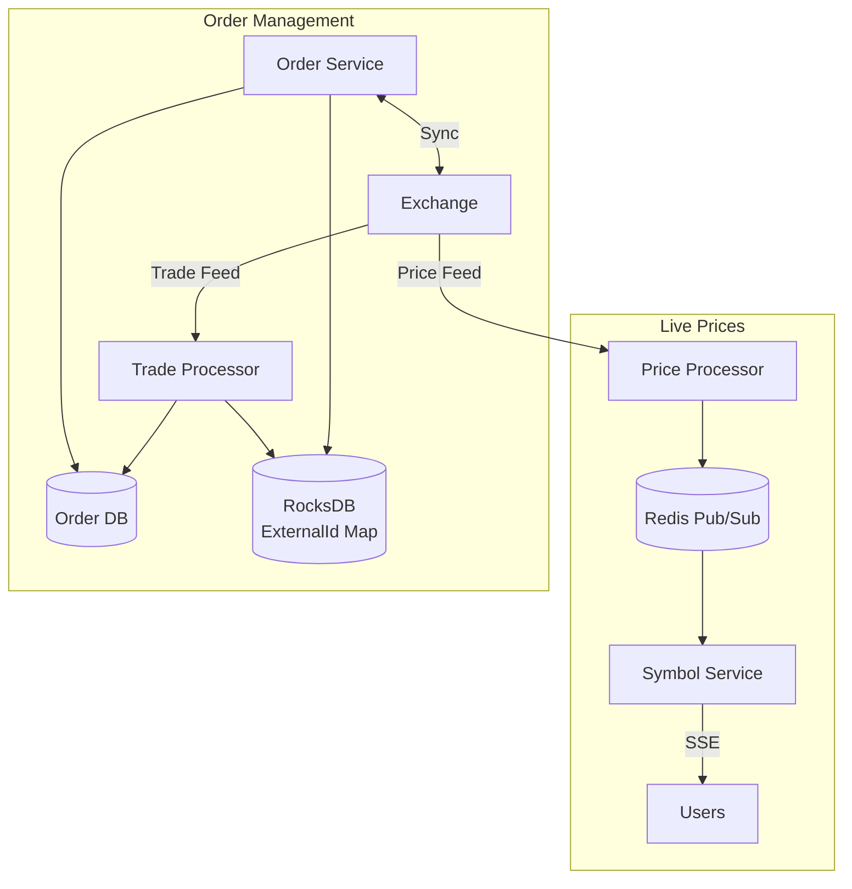

# Stock Broking Platform - Quick Cheatsheet

> ⏱️ **5-minute revision before interview**

---

## 📋 Requirements Summary

### Functional Requirements
| # | Requirement |
|---|-------------|
| 1 | Users see live stock prices |
| 2 | Users manage orders (create/cancel, market/limit) |

### Non-Functional Requirements
| # | Requirement | Target |
|---|-------------|--------|
| 1 | Consistency | Strong consistency for orders |
| 2 | Scale | 20M DAU, 100M trades/day |
| 3 | Latency | < 200ms |
| 4 | Connections | Minimize exchange connections (expensive) |

### Key Distinction
```
BROKER (what we build)     vs     EXCHANGE (external)
├── Routes orders                  ├── Executes orders
├── Displays prices                ├── Source of prices
└── User-facing                    └── Backend system
```

---

## 🏗️ High-Level Architecture



---

## 🔍 Deep Dives

### 1. Scaling Live Price Updates

| Approach | Description | Verdict |
|----------|-------------|---------|
| ❌ **Each server → Exchange** | Direct connections | Bad - Too many connections (expensive!) |
| ❌ **Broadcast all prices** | Send everything everywhere | Bad - Wasteful |
| ✅ **Redis Pub/Sub** | Subscribe only to needed symbols | Good - Efficient routing |

```
✅ GOOD:
   Exchange → 1 Price Processor → Redis Pub/Sub → N Symbol Servers → M Users
   Each server only subscribes to symbols its users care about

❌ BAD:
   100 Symbol Servers each connect to Exchange
   = 100 expensive exchange connections!
```

**Workflow:**
```
1. User subscribes to INFY, TCS
2. Symbol Server tracks: Symbol → Set<userId>
3. Symbol Server subscribes to Redis channels: INFY, TCS
4. Price Processor publishes INFY update to Redis
5. Symbol Server receives, pushes to users via SSE
6. On disconnect: unsubscribe if no users for symbol
```

### 2. Tracking Order Updates

| Problem | Solution |
|---------|----------|
| Exchange returns `externalOrderId` | Map it to our `orderId` |
| Order DB partitioned by `userId` | Need `userId` to find order |
| Can't lookup by `externalOrderId` | Use RocksDB key-value store |

```
✅ GOOD:
   RocksDB: externalOrderId → (orderId, userId)
   
   Trade arrives → Lookup in RocksDB → Get userId → Go to correct DB shard

❌ BAD:
   Scan all DB shards for externalOrderId → Slow!
```

### 3. Order Consistency & Fault Tolerance

| Approach | Description | Verdict |
|----------|-------------|---------|
| ❌ **Submit first, store later** | Call exchange, then store | Bad - If store fails, lost record! |
| ✅ **Store pending first** | Store order, then call exchange | Good - Always have a record |

**Order Creation:**
```
1. Store order (status=pending)      ← Do this FIRST
2. Submit to exchange                ← If this fails, mark failed
3. Store externalId mapping          ← If this fails, cleanup job fixes
4. Update status=submitted
5. Respond to client
```

**Order Cancellation:**
```
1. Update status=pending_cancel      ← Track intermediate state
2. Submit cancel to exchange
3. Update status=cancelled
4. Respond to client

If step 2/3 fails → Cleanup job scans pending_cancel orders
```

**Cleanup Job Pattern:**
```
Scan orders stuck in pending/pending_cancel
  → Query exchange using clientOrderId
  → Update status based on exchange response
```

### 4. Minimizing Exchange Connections

| Strategy | Implementation |
|----------|----------------|
| Single Price Processor | 1 connection for all price data |
| Order Service Pool | Limited instances with exchange access |
| Connection Pooling | Reuse connections |
| Batching | Multiple orders in one request |

```
✅ GOOD: 1 Price Processor + 10 Order Service instances = 11 connections
❌ BAD:  100 servers × 2 connections each = 200 connections!
```

---

## 📊 Key Numbers

| Metric | Value |
|--------|-------|
| DAU | 20 million |
| Trades/day | 100 million |
| Peak TPS | ~5,000 |
| Latency target | < 200ms |
| Symbols | 1,000s |
| Daily order storage | ~50 GB |

---

## 💬 Interview Phrases

1. *"We're building a broker, not an exchange - we route, exchange executes"*
2. *"Redis Pub/Sub decouples price feed from user connections"*
3. *"Store order as pending FIRST - if exchange fails, we still have record"*
4. *"Cleanup job reconciles stuck orders using clientOrderId"*
5. *"Partition orders by userId for fast user queries"*

---

## ⚠️ Pitfalls to Avoid

1. ❌ Each server connecting to exchange (too many connections)
2. ❌ Polling for prices (use SSE/WebSocket)
3. ❌ Submit to exchange before storing order (lose record on failure)
4. ❌ No intermediate state for cancellation (can't reconcile)
5. ❌ Using float for prices (precision issues - use cents!)
6. ❌ Lookup by externalOrderId in userId-partitioned DB (slow!)

---

## 🏗️ Technology Stack

| Component | Technology | Why |
|-----------|------------|-----|
| Live updates | SSE | Server → Client push |
| Price routing | Redis Pub/Sub | Efficient symbol-based routing |
| Order DB | PostgreSQL (partitioned) | ACID, partition by userId |
| ID Mapping | RocksDB | Fast key-value lookup |
| Cleanup | Cron job | Reconcile stuck orders |

---

## 🎯 Key Trade-offs

| Decision | Option A | Option B | Winner |
|----------|----------|----------|--------|
| Live prices | Polling | SSE | SSE (real-time) |
| Price distribution | Direct | Redis Pub/Sub | Redis (fewer connections) |
| DB partition key | orderId | userId | userId (user queries fast) |
| Order submission | Async | Sync | Sync (immediate confirmation) |
| Order storage | After exchange | Before exchange | Before (fault tolerance) |
