# Stock Broking Platform System Design

> **Difficulty**: Hard | **Company**: Zerodha, Groww, Upstox, E*TRADE, Fidelity

> ⚡ **[Quick Cheatsheet](./CHEATSHEET.md)** - 5-minute revision with Good vs Bad patterns

## Table of Contents
- [Overview](#overview)
- [Background: Financial Markets](#background-financial-markets)
- [Requirements](#requirements)
- [Core Entities](#core-entities)
- [API Design](#api-design)
- [High-Level Design](#high-level-design)
- [Deep Dives](#deep-dives)
- [Capacity Estimation](#capacity-estimation)
- [Interview Level Expectations](#interview-level-expectations)

---

## Overview

A stock broking platform allows users to view live stock prices and trade stocks. It's a **brokerage** (not an exchange) - it routes trades through external exchanges and provides real-time market data to users.


### Key Distinction: Broker vs Exchange

| Aspect | Broker (What we build) | Exchange (External) |
|--------|------------------------|---------------------|
| Role | Facilitates customer orders | Matches buy/sell orders |
| Data | Displays prices to users | Source of price data |
| Orders | Submits orders on behalf of users | Executes/fills orders |
| Examples | Zerodha, E*TRADE | NSE, NYSE, NASDAQ |

---

## Background: Financial Markets

### Key Terms

| Term | Definition | Example |
|------|------------|---------|
| **Symbol/Ticker** | Unique stock identifier | AAPL, RELIANCE, TCS |
| **Order** | Request to buy/sell stock | Buy 10 shares of INFY |
| **Market Order** | Buy/sell immediately at current price | No price target |
| **Limit Order** | Buy/sell at specified price or better | Buy if price ≤ ₹500 |

### Exchange Interface (Given)

| Capability | Type | Description |
|------------|------|-------------|
| **Order Processing** | Sync API | Place/cancel orders, get response |
| **Trade Feed** | Push/Webhook | Real-time trade updates (symbol, price, shares, orderId) |

---

## Requirements

### Functional Requirements ✅

| # | Requirement | Description |
|---|-------------|-------------|
| 1 | Live stock prices | Users see real-time price updates |
| 2 | Order management | Create/cancel market & limit orders |

**Out of Scope:**
- After-hours trading
- ETFs, options, crypto
- Real-time order book
- Multiple exchanges

### Non-Functional Requirements ✅

| # | Requirement | Target |
|---|-------------|--------|
| 1 | Consistency | Strong consistency for order management |
| 2 | Scale | 20M DAU, 5 trades/user/day, 1000s of symbols |
| 3 | Latency | < 200ms for price updates and order placement |
| 4 | Minimize Exchange Connections | Exchange connections are expensive |

---

## Core Entities


### Order Status Flow


---

## API Design

### 1. Get Symbol (Live Price)

```http
GET /symbol/:name
Authorization: Bearer {token}

Response:
{
  "name": "RELIANCE",
  "company": "Reliance Industries",
  "priceInCents": 245000,
  "lastUpdated": "2024-01-15T10:30:00Z"
}
```

### 2. Create Order

```http
POST /order
Authorization: Bearer {token}

Request:
{
  "position": "buy",
  "symbol": "INFY",
  "priceInCents": 152000,
  "numShares": 10,
  "type": "limit"
}

Response:
{
  "id": "ord_123",
  "status": "pending",
  "createdAt": "2024-01-15T10:30:00Z"
}
```

> 💡 Use `priceInCents` (integer) instead of float to avoid precision issues in financial calculations.

### 3. Cancel Order

```http
DELETE /order/:id
Authorization: Bearer {token}

Response:
{
  "ok": true,
  "status": "pending_cancel"
}
```

### 4. List Orders

```http
GET /orders?status=submitted&page=1
Authorization: Bearer {token}

Response:
{
  "orders": [...],
  "pagination": { "page": 1, "hasMore": true }
}
```

---

## High-Level Design

### Complete Architecture


---

### Live Price Flow

```mermaid
sequenceDiagram
    participant U as User
    participant SS as Symbol Service
    participant R as Redis Pub/Sub
    participant SPP as Price Processor
    participant E as Exchange

    U->>SS: Subscribe to INFY, TCS
    SS->>SS: Track user → symbols mapping
    SS->>R: Subscribe to INFY, TCS channels

    E->>SPP: Price update (INFY: ₹1520)
    SPP->>R: Publish to INFY channel
    R->>SS: Receive INFY update
    SS->>U: SSE push (INFY: ₹1520)

    Note over SS,R: Only subscribe to channels<br/>with active users

    U->>SS: Unsubscribe / Disconnect
    SS->>SS: Remove from mapping
    alt No users for symbol
        SS->>R: Unsubscribe from channel
    end
```



---

### Order Creation Flow

```mermaid
sequenceDiagram
    participant U as User
    participant OS as Order Service
    participant DB as Order DB
    participant KV as RocksDB
    participant E as Exchange

    U->>OS: POST /order
    OS->>DB: Store order (status=pending)
    OS->>E: Submit order (sync)
    E-->>OS: externalOrderId
    OS->>KV: Map externalId → (orderId, userId)
    OS->>DB: Update status=submitted, externalOrderId
    OS-->>U: Order created

    Note over OS,E: If exchange fails,<br/>mark order as failed
```



---

### Order Update Flow (Trade Processor)


---

## Deep Dives

### 1. Scaling Live Price Updates 📈

#### The Problem

- Millions of users subscribed to various symbols
- Need to route price updates to correct users
- Can't have each server connect directly to exchange

#### Solution: Redis Pub/Sub

| Approach | Description | Verdict |
|----------|-------------|---------|
| ❌ **Direct exchange per server** | Each server connects to exchange | Bad - Too many connections |
| ❌ **Broadcast all prices** | Send all prices to all servers | Bad - Wasteful bandwidth |
| ✅ **Redis Pub/Sub** | Subscribe only to needed symbols | Good - Efficient routing |


#### Workflow

1. User subscribes via Symbol Service server
2. Server maintains `Symbol → Set<userId>` mapping
3. Server subscribes to Redis channels for user's symbols
4. Price Processor publishes updates to Redis channels
5. Symbol Service receives update, fans out to connected users via SSE
6. On disconnect, remove user from mapping; if no users for symbol, unsubscribe

```
✅ GOOD:
   1 Price Processor → Redis → N Symbol Servers → M Users
   Each server only subscribes to symbols its users need

❌ BAD:
   Each Symbol Server connects to Exchange directly
   → 100 servers = 100 exchange connections (expensive!)
```

---

### 2. Tracking Order Updates 🔄

#### The Problem

- Exchange returns `externalOrderId` on trades
- Our Order DB is partitioned by `userId`
- Can't efficiently lookup by `externalOrderId`

#### Solution: External ID Mapping


| Step | Action |
|------|--------|
| 1 | Order submitted to exchange, get `externalOrderId` |
| 2 | Store mapping: `externalOrderId → (orderId, userId)` in RocksDB |
| 3 | Trade arrives from exchange with `externalOrderId` |
| 4 | Lookup mapping to get `orderId`, `userId` |
| 5 | Go to correct DB shard (via `userId`), update order |

---

### 3. Order Consistency & Fault Tolerance 🛡️

#### Order Creation Workflow


#### Failure Handling

| Failure Point | Impact | Solution |
|---------------|--------|----------|
| **Store pending fails** | No order created | Return error to client |
| **Exchange submission fails** | Order exists but not submitted | Mark as failed, return error |
| **Post-exchange update fails** | Order on exchange, not in DB | Cleanup job queries exchange |

#### Cleanup Job Pattern


> 💡 **clientOrderId**: Most exchanges allow passing a custom ID when submitting orders. Use this for reconciliation.

---

#### Order Cancellation Workflow


| Approach | Description | Verdict |
|----------|-------------|---------|
| ❌ **Cancel directly** | No intermediate state | Bad - Can't recover from failures |
| ✅ **pending_cancel state** | Track cancellation in progress | Good - Cleanup job can reconcile |

```
✅ GOOD:
   1. Mark pending_cancel → 2. Cancel on exchange → 3. Mark cancelled
   If step 2 or 3 fails → Cleanup job scans pending_cancel orders

❌ BAD:
   1. Cancel on exchange → 2. Mark cancelled
   If step 2 fails → Order cancelled but DB shows submitted!
```

---

### 4. Minimizing Exchange Connections 💰

Exchange connections are expensive (licensing, infrastructure). Minimize them:

| Strategy | Description |
|----------|-------------|
| **Single Price Processor** | One service connects to price feed, publishes to Redis |
| **Order Service Pool** | Limited pool of order service instances with exchange connections |
| **Connection Pooling** | Reuse connections for multiple orders |
| **Batching** | Batch multiple orders in single request (if exchange supports) |


---

## Capacity Estimation

### Traffic

| Metric | Value |
|--------|-------|
| Daily Active Users | 20 million |
| Trades per user per day | 5 |
| Total trades per day | 100 million |
| Trades per second (peak) | ~5,000 TPS |
| Symbols | 1,000s |

### Price Updates

| Metric | Value |
|--------|-------|
| Price updates per symbol | ~1/second |
| Total updates per second | ~1,000-5,000 |
| Users watching each symbol | Varies (popular stocks: millions) |

### Storage

| Data | Calculation | Result |
|------|-------------|--------|
| Orders per day | 100M | - |
| Order size | ~500 bytes | - |
| Daily order storage | 100M × 500B | **50 GB/day** |
| Yearly | 50 GB × 365 | **~18 TB/year** |

### Connections

| Component | Connections |
|-----------|-------------|
| Exchange (price feed) | 1 (Price Processor) |
| Exchange (order API) | ~10-50 (Order Service pool) |
| Redis Pub/Sub | 100s (Symbol Service instances) |
| User SSE | Millions |

---

## Interview Level Expectations

### Mid-Level 👨‍💻

| Should Demonstrate | Acceptable Gaps |
|--------------------|-----------------|
| Define API endpoints and data model | Redis Pub/Sub details |
| Basic high-level design for prices + orders | Fault tolerance edge cases |
| Understand need to proxy exchange | Order consistency workflow |
| Converge on SSE for live prices | Cleanup job pattern |

### Senior 👩‍💼

| Should Demonstrate | Nice to Have |
|--------------------|--------------|
| Redis Pub/Sub for price distribution | Advanced batching strategies |
| Consistent order workflow | Real-time order updates to users |
| Fault tolerance considerations | Historical price data design |
| Explain why partition by userId | |
| externalOrderId mapping pattern | |

### Staff+ 🏆

| Should Demonstrate | Deep Expertise In |
|--------------------|-------------------|
| Complete fault-tolerant order workflow | Production trading system experience |
| All consistency edge cases | Exchange API nuances |
| Proactive on cleanup job pattern | Rate limiting for excess updates |
| Technology choices with justification | Multiple exchange handling |

---

## Additional Considerations

### Live Order Updates to Users

Similar to price updates, use Redis Pub/Sub:
- Trade Processor publishes order updates to user-specific channel
- User's connected server subscribes to their channel
- Push updates via SSE

### Historical Data

| Data Type | Storage | Access Pattern |
|-----------|---------|----------------|
| Historical prices | Time-series DB (InfluxDB) | By symbol + time range |
| Portfolio history | OLAP DB | By user + time range |

### Excess Price Updates

If a symbol has too many updates:
- Throttle at Price Processor (max 1 update/100ms)
- Client-side debouncing
- Send only significant price changes (> 0.1%)

---

## References

- [Exchange APIs (E*TRADE)](https://developer.etrade.com/)
- [WebSocket vs SSE](https://developer.mozilla.org/en-US/docs/Web/API/Server-sent_events)
- [Redis Pub/Sub](https://redis.io/topics/pubsub)
- [ACID Transactions](https://en.wikipedia.org/wiki/ACID)
