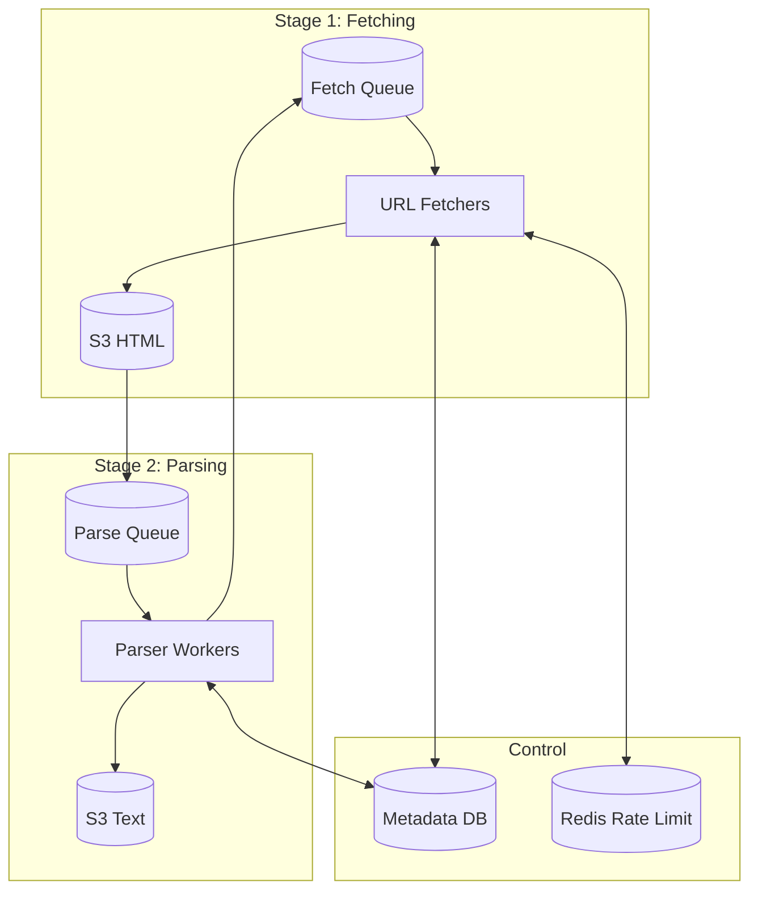

# Web Crawler - Quick Cheatsheet

> ⏱️ **5-minute revision before interview**

---

## 📋 Requirements Summary

### Functional Requirements
| # | Requirement |
|---|-------------|
| 1 | Crawl web starting from seed URLs |
| 2 | Extract text data and store for processing |

### Non-Functional Requirements
| # | Requirement | Target |
|---|-------------|--------|
| 1 | Fault Tolerance | Resume without losing progress |
| 2 | Politeness | Respect robots.txt, 1 req/sec/domain |
| 3 | Efficiency | Complete in 5 days |
| 4 | Scale | 10 billion pages |

---

## 🏗️ High-Level Architecture



---

## 🔍 Deep Dives

### 1. Fault Tolerance

| Approach | Description | Verdict |
|----------|-------------|---------|
| ❌ **Monolithic Crawler** | One service does fetch + parse + extract | Bad - Single failure loses all progress |
| ✅ **Multi-Stage Pipeline** | Separate fetch and parse stages | Good - Isolate failures, retry independently |

```
✅ GOOD:
   Fetcher fails → URL stays in queue → Another fetcher picks up
   Parser fails → HTML still in S3 → Just re-parse

❌ BAD:
   Monolithic crawler fails mid-parse → Lost fetched HTML → Refetch everything
```

**SQS Retry Pattern:**
```
Message → Fetch attempt → Failure → Visibility timeout → Retry
                                                ↓
                                    After 3 retries → Dead Letter Queue
```

### 2. Politeness & robots.txt

| Approach | Description | Verdict |
|----------|-------------|---------|
| ❌ **Ignore robots.txt** | Crawl everything | Bad - Get blocked, unethical |
| ❌ **Per-crawler rate limit** | Each crawler limits itself | Bad - N crawlers = N× requests |
| ✅ **Global rate limit** | Redis-based domain limiting | Good - True 1 req/sec enforcement |

```
✅ GOOD:
   1. Check robots.txt (cached) → Allowed?
   2. Check Redis rate limit → Within 1 req/sec?
   3. If both OK → Crawl
   4. If rate limited → Re-queue with delay + jitter

❌ BAD:
   Multiple crawlers → All hit example.com simultaneously → Server overload → Blocked!
```

**robots.txt Example:**
```
User-agent: *
Disallow: /private/
Crawl-delay: 10   # Wait 10 seconds between requests
```

### 3. Scaling to 10B Pages in 5 Days

| Approach | Description | Verdict |
|----------|-------------|---------|
| ❌ **Single machine** | One crawler does everything | Bad - Takes 15+ days |
| ✅ **Parallel fetchers** | 4 machines × 7.5k pages/s | Good - ~30k pages/s = 4 days |

**Math:**
```
Required rate: 10B pages ÷ 5 days ÷ 86400 sec = 23,148 pages/sec

Per machine (30% efficiency): 7,500 pages/sec
Machines needed: 23,148 ÷ 7,500 = 3.1 → 4 machines
```

### 4. DNS Optimization

| Approach | Description | Verdict |
|----------|-------------|---------|
| ❌ **DNS per request** | Lookup every time | Bad - Hit rate limits, slow |
| ✅ **DNS caching** | Cache lookups locally | Good - Reuse for same domain |
| ✅ **Multiple providers** | Cloudflare + Google + Route53 | Good - Avoid single provider limits |

```
✅ GOOD: Cache DNS + Multiple providers (round-robin)
❌ BAD:  Every URL → DNS lookup → Rate limited → Blocked
```

### 5. Avoiding Duplicate Work

| Approach | Description | Verdict |
|----------|-------------|---------|
| ❌ **No dedup** | Crawl everything | Bad - Waste resources |
| ✅ **URL check in DB** | Check before queueing | Good - Simple, effective |
| ✅ **Content hash** | Hash page content | Good - Catches same content, different URLs |
| ⚠️ **Bloom filter** | Probabilistic dedup | OK - Memory efficient, false positives |

```
✅ GOOD:
   Before queue: Check Metadata DB → URL exists? Skip!
   After crawl: Hash content → Same hash? Duplicate!

❌ BAD: Queue all URLs, dedupe later → Wasted fetches
```

### 6. Crawler Traps

| Approach | Description | Verdict |
|----------|-------------|---------|
| ❌ **No depth limit** | Follow all links forever | Bad - Infinite loops |
| ✅ **Max depth** | Stop at depth 15-20 | Good - Prevents traps |

```
✅ GOOD: Track depth per URL → Stop if depth > 15
❌ BAD:  /page/1 → /page/2 → /page/3 → ... → /page/999999 (infinite!)
```

---

## 📊 Key Numbers

| Metric | Value |
|--------|-------|
| Total pages | 10 billion |
| Average page | 2 MB |
| Time limit | 5 days |
| Required rate | ~23,000 pages/sec |
| Machines needed | 4 |
| Rate limit | 1 req/sec/domain |
| Max crawl depth | 15-20 |
| Raw HTML storage | ~20 PB |

---

## 💬 Interview Phrases

1. *"Pipeline stages isolate failures - HTML in S3 survives parser crashes"*
2. *"Global Redis rate limiting ensures true 1 req/sec per domain across all crawlers"*
3. *"DNS caching + multiple providers avoids DNS bottleneck"*
4. *"Max depth prevents crawler traps from infinite loops"*
5. *"Content hashing catches duplicate content across different URLs"*

---

## ⚠️ Pitfalls to Avoid

1. ❌ Monolithic crawler (all-or-nothing failure)
2. ❌ Ignoring robots.txt (get blocked, unethical)
3. ❌ Per-crawler rate limiting (ineffective at scale)
4. ❌ DNS lookup per request (bottleneck)
5. ❌ No crawler trap protection (infinite loops)
6. ❌ No content deduplication (wasted work)

---

## 🏗️ Technology Stack

| Component | Technology | Why |
|-----------|------------|-----|
| Queue | SQS | Built-in retries, DLQ, visibility timeout |
| Blob Storage | S3 | Cheap, durable, scalable |
| Metadata DB | DynamoDB | Key-value, scalable |
| Rate Limiting | Redis | Fast, distributed counters |
| DNS | Multiple providers | Avoid single point rate limits |
