# Web Crawler System Design

> **Difficulty**: Hard | **Company**: Google, Bing, OpenAI, Meta

> ⚡ **[Quick Cheatsheet](./CHEATSHEET.md)** - 5-minute revision with Good vs Bad patterns

## Table of Contents
- [Overview](#overview)
- [Requirements](#requirements)
- [System Interface](#system-interface)
- [Data Flow](#data-flow)
- [High-Level Design](#high-level-design)
- [Deep Dives](#deep-dives)
- [Capacity Estimation](#capacity-estimation)
- [Interview Level Expectations](#interview-level-expectations)
- [Quick Revision Cheatsheet](#quick-revision-cheatsheet)

---

## Overview

A web crawler automatically traverses the web by downloading pages and following links. Used for search engine indexing, data collection for LLM training, or website monitoring.


### Use Cases

| Use Case | Company | Output |
|----------|---------|--------|
| Search Indexing | Google, Bing | Indexed + Ranked pages |
| LLM Training | OpenAI, Meta | Raw text corpus |
| Monitoring | Datadog | Change detection |

---

## Requirements

### Functional Requirements ✅

| # | Requirement | Description |
|---|-------------|-------------|
| 1 | Crawl from seeds | Start from given seed URLs |
| 2 | Extract & store text | Extract text data and store for processing |

**Out of Scope:**
- Processing text (LLM training)
- Non-text data (images, videos)
- Dynamic content (JavaScript-rendered)
- Authentication (login-required pages)

### Non-Functional Requirements ✅

| # | Requirement | Target |
|---|-------------|--------|
| 1 | Fault Tolerance | Resume without losing progress |
| 2 | Politeness | Respect robots.txt, don't overload servers |
| 3 | Efficiency | Crawl in under 5 days |
| 4 | Scale | Handle 10B pages |

**Scale Parameters:**
- **10 billion pages** on the web
- **2 MB average page size**
- **5 days** to complete crawl

---

## System Interface

```
┌─────────────────────────────────────────────────────────────┐
│                    SYSTEM BOUNDARY                          │
├─────────────────────────────────────────────────────────────┤
│                                                             │
│   INPUT                              OUTPUT                 │
│   ─────                              ──────                 │
│   Seed URLs                          Extracted text data    │
│   (starting points)                  (stored in S3)         │
│                                                             │
│   Example:                           Example:               │
│   - google.com                       - Page text corpus     │
│   - wikipedia.org                    - Metadata             │
│   - reddit.com                       - URL graph            │
│                                                             │
└─────────────────────────────────────────────────────────────┘
```

---

## Data Flow


### Step-by-Step

| Step | Action | Component |
|------|--------|-----------|
| 1 | Take seed URL from queue | Frontier Queue |
| 2 | Request IP from DNS | DNS Resolver |
| 3 | Fetch HTML from server | URL Fetcher |
| 4 | Extract text from HTML | Parser Worker |
| 5 | Store text data | S3 Blob Storage |
| 6 | Extract linked URLs | Parser Worker |
| 7 | Add URLs to frontier | Frontier Queue |
| 8 | Repeat until done | - |

---

## High-Level Design

### Basic Architecture


### Core Components

| Component | Purpose | Technology |
|-----------|---------|------------|
| **Frontier Queue** | Queue of URLs to crawl | SQS, Kafka |
| **Crawler** | Fetch pages, extract data | EC2, Lambda |
| **DNS** | Resolve domain → IP | Route 53, Cloudflare |
| **S3 Text Data** | Store extracted text | S3, GCS |
| **Metadata DB** | Track crawled URLs | DynamoDB, PostgreSQL |

---

### Improved Architecture (Multi-Stage Pipeline)


---

### URL Fetching Flow


---

### Parsing Flow


---

## Deep Dives

### 1. Fault Tolerance 🛡️

#### The Problem

Single monolithic crawler doing everything = single point of failure.

```
❌ BAD: Crawler does DNS + Fetch + Parse + Extract URLs
        If any step fails → Lose all progress!
```

#### Solution: Multi-Stage Pipeline

| Approach | Description | Verdict |
|----------|-------------|---------|
| ❌ **Monolithic Crawler** | One service does everything | Bad - All-or-nothing failure |
| ✅ **Pipelined Stages** | Separate fetch and parse | Good - Isolate failures |

```
✅ GOOD:
   Stage 1: Fetcher → Downloads HTML → Stores in S3
   Stage 2: Parser → Reads HTML → Extracts text + URLs

   If parser fails → HTML still in S3, just re-parse!
```


#### Queue Retry Mechanisms

**SQS Approach (Recommended):**


| Feature | SQS | Kafka |
|---------|-----|-------|
| Retry | Visibility timeout | Offset management |
| DLQ | Built-in | Manual setup |
| Backoff | Built-in | Manual |
| Complexity | Low | Higher |

#### Handling Fetch Failures

| Failure Type | Action |
|--------------|--------|
| 404 Not Found | Mark dead, don't retry |
| 5xx Server Error | Retry with backoff |
| Timeout | Retry with backoff |
| DNS Failure | Retry, check DNS cache |
| Max retries exceeded | Send to DLQ |

---

### 2. Politeness & robots.txt 🤝

#### What is robots.txt?

```
User-agent: *
Disallow: /private/
Disallow: /admin/
Crawl-delay: 10
```

| Directive | Meaning |
|-----------|---------|
| `User-agent: *` | Applies to all crawlers |
| `Disallow: /private/` | Don't crawl /private/ |
| `Crawl-delay: 10` | Wait 10s between requests |

#### Implementation


#### Rate Limiting Architecture

| Approach | Description | Verdict |
|----------|-------------|---------|
| ❌ **No rate limiting** | Hammer servers freely | Bad - Get blocked, overwhelm sites |
| ⚠️ **Per-crawler limit** | Each crawler limits itself | OK - But N crawlers = N× requests |
| ✅ **Global rate limit** | Centralized Redis counter | Good - True domain-level limiting |


**Standard: 1 request/second/domain**

#### Handling Synchronized Crawlers

**Problem:** All crawlers waiting → All retry at same time → Only 1 succeeds

**Solution: Jitter**

```python
delay = base_delay + random(0, max_jitter)
# Example: 1.0s + random(0, 0.5s) = 1.0-1.5s
```

---

### 3. Scaling to 10B Pages in 5 Days 📈

#### Capacity Calculation

| Metric | Value |
|--------|-------|
| Total pages | 10,000,000,000 |
| Time limit | 5 days = 432,000 seconds |
| Required rate | 10B ÷ 432,000 = **23,148 pages/sec** |

#### Per-Machine Capacity

| Factor | Value |
|--------|-------|
| Network bandwidth | 400 Gbps (network-optimized) |
| Average page size | 2 MB |
| Theoretical max | 400 Gbps ÷ 8 ÷ 2 MB = 25,000 pages/s |
| Realistic (30% efficiency) | ~7,500 pages/s |

#### Machines Needed

```
Single machine: 10B ÷ 7,500/s = 1,333,333s = 15.4 days

Machines needed: 15.4 days ÷ 5 days = 3.1 → 4 machines
```

#### Scaling Architecture

```mermaid
flowchart TB
    subgraph Fetchers[URL Fetchers - 4 machines]
        F1[Fetcher 1<br/>7.5k/s]
        F2[Fetcher 2<br/>7.5k/s]
        F3[Fetcher 3<br/>7.5k/s]
        F4[Fetcher 4<br/>7.5k/s]
    end

    subgraph Parsers[Parser Workers - Auto-scaled]
        P1[Parser λ]
        P2[Parser λ]
        PN[Parser λ...]
    end

    Queue[(Frontier Queue)] --> F1 & F2 & F3 & F4
    F1 & F2 & F3 & F4 --> S3[(S3 HTML)]
    S3 --> ParseQ[(Parse Queue)]
    ParseQ --> P1 & P2 & PN
```



#### DNS Optimization

| Approach | Description | Verdict |
|----------|-------------|---------|
| ❌ **No caching** | DNS lookup per request | Bad - Slow, rate limits |
| ✅ **DNS caching** | Cache lookups locally | Good - Reduce DNS load |
| ✅ **Multiple providers** | Round-robin DNS providers | Good - Avoid rate limits |

```
✅ GOOD:
   - Cache DNS: All URLs to same domain reuse lookup
   - Multiple providers: Cloudflare + Google DNS + Route 53

❌ BAD:
   - Every request → DNS lookup → Hit rate limits
```

#### Avoiding Duplicate Work

| Approach | Description | Verdict |
|----------|-------------|---------|
| ❌ **No dedup** | Crawl everything again | Bad - Waste resources |
| ✅ **URL check in DB** | Check Metadata DB before queueing | Good - Simple, effective |
| ⚠️ **Bloom filter** | Probabilistic URL dedup | OK - Memory efficient, false positives |
| ✅ **Content hash** | Hash page content, check duplicates | Good - Catches same content, diff URLs |

```
✅ GOOD:
   Before queueing URL:
   1. Check if URL in Metadata DB → Skip if exists
   2. After crawl, hash content → Check for duplicates

❌ BAD:
   Queue everything, dedupe later → Wasted fetches
```

#### Crawler Traps

**Problem:** Infinite loops, dynamically generated URLs

```
example.com/page/1 → links to → /page/2 → /page/3 → ... → /page/999999
```

**Solution: Maximum Depth**


| Parameter | Recommended Value |
|-----------|-------------------|
| Max depth | 15-20 levels |
| Max URLs per domain | 10,000-100,000 |

---

## Capacity Estimation

### Storage

| Data | Calculation | Result |
|------|-------------|--------|
| Raw HTML | 10B × 2 MB | **20 PB** |
| Extracted text | 10B × 50 KB (avg) | **500 TB** |
| Metadata | 10B × 500 bytes | **5 TB** |

### Throughput

| Metric | Value |
|--------|-------|
| Required rate | 23,148 pages/sec |
| Per machine | 7,500 pages/sec |
| Machines needed | 4 (with buffer) |

### Queue Sizing

| Queue | Messages | Size |
|-------|----------|------|
| Frontier | 10B URLs | ~1 TB |
| Parse | Peak 1M pending | ~10 GB |

---

## Interview Level Expectations

### Mid-Level 👨‍💻

| Should Demonstrate | Acceptable Gaps |
|--------------------|-----------------|
| High-level data flow | Queue technology specifics |
| Basic politeness (robots.txt) | Rate limiting implementation |
| Understand need to scale | Exact machine calculations |
| Simple retry mechanism | Multi-stage pipeline |

### Senior 👩‍💼

| Should Demonstrate | Nice to Have |
|--------------------|--------------|
| Multi-stage pipeline design | Bloom filter details |
| robots.txt + rate limiting | DNS optimization strategies |
| Scaling calculations | Crawler trap handling |
| Queue retry mechanisms | Content deduplication |
| Justify technology choices | |

### Staff+ 🏆

| Should Demonstrate | Deep Expertise In |
|--------------------|-------------------|
| Complete fault-tolerant design | Production crawler experience |
| All politeness mechanisms | Multiple DNS provider strategy |
| Detailed scaling math | Dynamic content handling |
| Proactively identify crawler traps | Teach interviewer something new |
| Content deduplication strategies | |

---

## Quick Revision Cheatsheet

### 🔑 Key Concepts (One-liners)

| Concept | Remember This |
|---------|---------------|
| **Multi-stage pipeline** | Separate fetch and parse for fault tolerance |
| **robots.txt** | Check before crawling, respect Crawl-delay |
| **Rate limiting** | 1 req/sec/domain via Redis |
| **DNS caching** | Cache lookups, use multiple providers |
| **Crawler traps** | Max depth limit prevents infinite loops |
| **Deduplication** | Check URL in DB + hash content |

### 📊 Numbers to Remember

| Metric | Value |
|--------|-------|
| Total pages | 10 billion |
| Average page size | 2 MB |
| Time limit | 5 days |
| Required rate | ~23k pages/sec |
| Machines needed | 4 |
| Standard rate limit | 1 req/sec/domain |

### 🎯 Key Trade-offs

| Decision | Option A | Option B | Winner |
|----------|----------|----------|--------|
| Architecture | Monolithic | Pipeline | Pipeline (fault tolerance) |
| Queue | Kafka | SQS | SQS (simpler retries) |
| Dedup | Bloom filter | DB index | DB index (simpler) |
| Rate limit | Per-crawler | Global Redis | Global (accurate) |

### 💬 Interview Phrases

1. *"Pipeline stages isolate failures - if parsing fails, HTML is still in S3"*
2. *"Global rate limiting via Redis ensures true 1 req/sec per domain"*
3. *"DNS caching + multiple providers avoids DNS bottleneck"*
4. *"Max depth prevents crawler traps from infinite loops"*
5. *"Content hashing catches duplicate content across different URLs"*

### ⚠️ Pitfalls to Avoid

1. ❌ Monolithic crawler (all-or-nothing failure)
2. ❌ Ignoring robots.txt
3. ❌ No rate limiting (get blocked)
4. ❌ DNS lookup per request
5. ❌ No crawler trap protection

---

## Additional Considerations

### Dynamic Content (JavaScript)

| Approach | Tool | Use Case |
|----------|------|----------|
| Headless browser | Puppeteer, Playwright | JS-rendered pages |
| Pre-rendering service | Prerender.io | SPA applications |

### Continuous Crawling


### Monitoring

| Metric | Alert Threshold |
|--------|-----------------|
| Crawl rate | < 20k/sec |
| Error rate | > 5% |
| Queue depth | > 100M pending |
| DLQ size | > 10k |

---

## References

- [Google Crawler Documentation](https://developers.google.com/search/docs/crawling-indexing)
- [robots.txt Specification](https://www.robotstxt.org/)
- [Mercator: A Scalable Web Crawler](https://www.researchgate.net/publication/2375840_Mercator_A_Scalable_Extensible_Web_Crawler)
